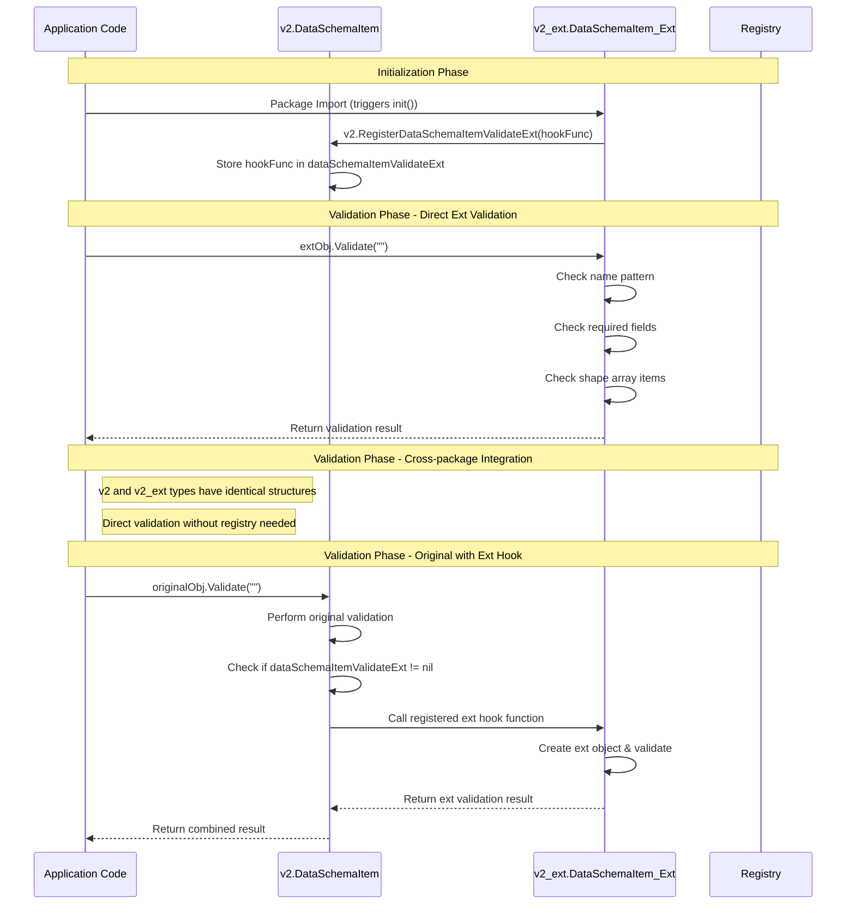

# Validation and Ext Compiler Flow Charts

## 1. Overall System Architecture

```mermaid
graph TB
    subgraph "Input Proto Files"
        V2[v2/schema.proto<br/>Original Proto]
        V2E[v2_ext/schema_ext.proto<br/>Ext Proto with Validation]
    end
    
    subgraph "Bazel Build Process"
        VC[Validation Compiler<br/>protoc-gen-validation]
        EC[Ext Compiler<br/>protoc-gen-ext]
        
        V2 --> VC
        V2E --> EC
        VC --> EC
    end
    
    subgraph "Generated Files"
        VGO[schema.pb.validation.go<br/>Register Functions]
        EGO[schema_ext.ext.go<br/>Ext Validation]
        
        VC --> VGO
        EC --> EGO
    end
    
    subgraph "Runtime Integration"
        REG[Register Hook<br/>v2.RegisterDataSchemaItemValidateExt]
        CALL[Validation Call<br/>original.Validate() → ext.Validate()]
        
        VGO --> REG
        EGO --> REG
        REG --> CALL
    end
    
    style VC fill:#e1f5fe
    style EC fill:#f3e5f5
    style VGO fill:#e8f5e8
    style EGO fill:#fff3e0
```

## 2. Validation Compiler Flow (protoc-gen-validation)

```mermaid
flowchart TD
    Start([Start: protoc-gen-validation]) --> Input[Input: v2/schema.proto]
    
    Input --> Parse[Parse Proto Descriptors]
    Parse --> CheckMsg{For Each Message}
    
    CheckMsg --> ReadOpts[Read Message Options<br/>validation annotations]
    ReadOpts --> HasVal{Has Validation<br/>Annotations?}
    
    HasVal -->|Yes| GenVal[Generate Validate() Function<br/>with validation logic]
    HasVal -->|No| GenEmpty[Generate Empty Validate() Function]
    
    GenVal --> GenReg[Generate Register Functions<br/>RegisterXXXValidateExt()]
    GenEmpty --> GenReg
    
    GenReg --> GenVar[Generate Extension Variables<br/>xxxValidateExt func()]
    GenVar --> WriteFile[Write .pb.validation.go File]
    
    CheckMsg -->|More Messages| ReadOpts
    CheckMsg -->|Done| WriteFile
    
    WriteFile --> End([End: schema.pb.validation.go])
    
    subgraph "Generated Content"
        GC1[func (this *DataSchema) Validate(prefix string) error]
        GC2[func RegisterDataSchemaValidateExt(f func(*DataSchema, string) error)]
        GC3[var dataSchemaValidateExt func(*DataSchema, string) error]
    end
    
    WriteFile --> GC1
    WriteFile --> GC2
    WriteFile --> GC3
    
    style Start fill:#e1f5fe
    style End fill:#e8f5e8
    style GenVal fill:#fff3e0
    style GenReg fill:#f3e5f5
```

## 3. Ext Compiler Flow (protoc-gen-ext)

```mermaid
flowchart TD
    Start([Start: protoc-gen-ext]) --> Input[Input: v2_ext/schema_ext.proto]
    
    Input --> CheckOpt[Check ext_original_proto Option]
    CheckOpt --> FindOrig[Find Original Proto File<br/>v2/schema.proto]
    
    FindOrig --> Verify{Verify Fields<br/>Match Original?}
    Verify -->|No| Error[Error: Field Mismatch]
    Verify -->|Yes| ParseExt[Parse Ext Proto Messages]
    
    ParseExt --> ForMsg{For Each Ext Message}
    ForMsg --> ReadVal[Read Validation Annotations<br/>pattern, min, max, required, etc.]
    
    ReadVal --> GenPatterns[Generate Pattern Variables<br/>var pattern0 = regexp.MustCompile(...)]
    GenPatterns --> GenSets[Generate Set Variables<br/>var set0 = map[string]bool{...}]
    
    GenSets --> GenValidate[Generate Validate() Function<br/>with ext validation logic]
    GenValidate --> GenInit[Generate init() Function]
    
    GenInit --> ImportOrig[Import Original Package<br/>v2 "github.com/.../proto/api/v2"]
    ImportOrig --> CallReg[Call Original Register Function<br/>v2.RegisterDataSchemaItemValidateExt()]
    
    CallReg --> UnsafeConv[Use Unsafe Pointer Conversion<br/>extMsg := (*ExtType)(unsafe.Pointer(orig))]
    
    ForMsg -->|More Messages| ReadVal
    ForMsg -->|Done| WriteFile[Write .ext.go File]
    
    GenGlobal --> WriteFile
    WriteFile --> End([End: schema_ext.ext.go])
    
    Error --> End
    
    subgraph "Generated Validation Logic"
        V1[Required Field Validation]
        V2[Pattern Matching with Regex]
        V3[Min/Max Value Validation]
        V4[Array Items Validation]
        V5[Length Validation]
    end
    
    GenValidate --> V1
    GenValidate --> V2
    GenValidate --> V3
    GenValidate --> V4
    GenValidate --> V5
    
    style Start fill:#f3e5f5
    style End fill:#fff3e0
    style Verify fill:#ffebee
    style GenValidate fill:#e8f5e8
    style CallReg fill:#e1f5fe
```

## 4. Runtime Execution Flow



## 5. File Generation Dependencies

```mermaid
graph LR
    subgraph "Build Phase 1: Validation Compiler"
        V2P[v2/schema.proto] --> VCO[Validation Compiler]
        VCO --> VGO[schema.pb.validation.go<br/>✓ Validate() functions<br/>✓ Register functions<br/>✓ Extension hooks]
    end
    
    subgraph "Build Phase 2: Ext Compiler"
        V2EXT[v2_ext/schema_ext.proto] --> ECO[Ext Compiler]
        VGO --> ECO
        ECO --> EGO[schema_ext.ext.go<br/>✓ Ext Validate() functions<br/>✓ Direct unsafe conversion<br/>✓ Runtime integration]
    end
    
    subgraph "Runtime"
        APP[Application Code]
        VGO --> APP
        EGO --> APP
        APP --> HOOK[Validation Hooks<br/>original ↔ ext]
    end
    
    style VCO fill:#e1f5fe
    style ECO fill:#f3e5f5
    style VGO fill:#e8f5e8
    style EGO fill:#fff3e0
    style HOOK fill:#ffebee
```

## 6. Validation Logic Flow for Ext Compiler

```mermaid
flowchart TD
    Start([Field Validation Start]) --> FieldType{Field Type?}
    
    FieldType -->|String| StrVal[String Validations<br/>• Required check<br/>• Pattern matching<br/>• Length validation]
    FieldType -->|Number| NumVal[Number Validations<br/>• Required check<br/>• Min/Max validation<br/>• Range checking]
    FieldType -->|Array| ArrVal[Array Validations<br/>• Required check<br/>• Items validation<br/>• Min/Max items]
    FieldType -->|Enum| EnumVal[Enum Validations<br/>• Required check<br/>• Valid value check]
    
    StrVal --> PatternCheck{Has Pattern?}
    PatternCheck -->|Yes| GenRegex[Generate Regex Pattern<br/>var pattern0 = regexp.MustCompile(...)]
    PatternCheck -->|No| LengthCheck{Has Length Rules?}
    
    GenRegex --> RegexValidation[Add Pattern Validation<br/>!pattern0.MatchString(this.Field)]
    RegexValidation --> LengthCheck
    
    LengthCheck -->|Yes| GenLength[Add Length Validation<br/>len(this.Field) < minLen<br/>len(this.Field) > maxLen]
    LengthCheck -->|No| RequiredCheck
    
    NumVal --> MinMaxCheck{Has Min/Max?}
    MinMaxCheck -->|Yes| GenMinMax[Add Min/Max Validation<br/>this.Field < min<br/>this.Field > max]
    MinMaxCheck -->|No| RequiredCheck
    
    ArrVal --> ItemsCheck{Has Items Rules?}
    ItemsCheck -->|Yes| GenItems[Generate Items Loop<br/>for i, v := range this.Field]
    ItemsCheck -->|No| RequiredCheck
    
    GenItems --> ItemValidation[Add Item Validation<br/>v < itemMin<br/>v > itemMax]
    ItemValidation --> RequiredCheck
    
    EnumVal --> RequiredCheck
    GenLength --> RequiredCheck
    GenMinMax --> RequiredCheck
    
    RequiredCheck{Required Field?}
    RequiredCheck -->|Yes| GenRequired[Add Required Check<br/>this.Field == defaultValue]
    RequiredCheck -->|No| GenCode
    
    GenRequired --> GenCode[Generate Validation Code<br/>if condition {<br/>  return status.Error(...)<br/>}]
    
    GenCode --> End([Field Validation Complete])
    
    style Start fill:#e1f5fe
    style End fill:#e8f5e8
    style GenRegex fill:#fff3e0
    style GenItems fill:#f3e5f5
    style GenCode fill:#ffebee
```

## 7. Key Integration Points

### Dependency Flow:
1. **Input**: `v2/schema.proto` + `v2_ext/schema_ext.proto`
2. **Phase 1**: Validation compiler generates Register functions in v2 package
3. **Phase 2**: Ext compiler imports v2 package and calls Register functions
4. **Runtime**: Original validation can trigger ext validation through hooks

### Critical Success Factors:
- ✅ **Build Order**: Validation compiler must run before ext compiler
- ✅ **Field Verification**: Ext proto fields must match original proto exactly
- ✅ **Import Resolution**: Ext package must successfully import original package
- ✅ **Function Availability**: Register functions must be generated and accessible
- ✅ **Runtime Integration**: Hook registration must work at package initialization
