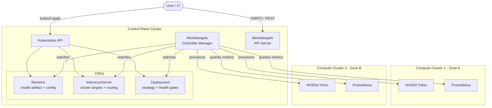
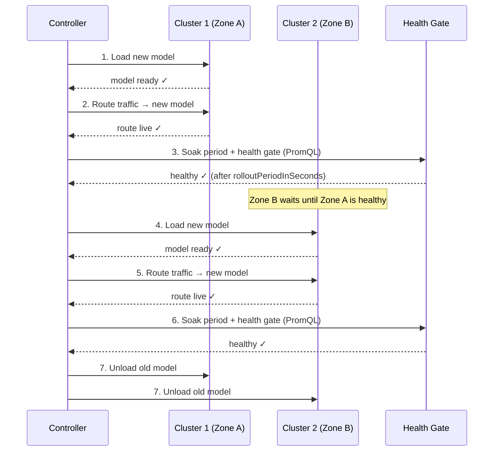
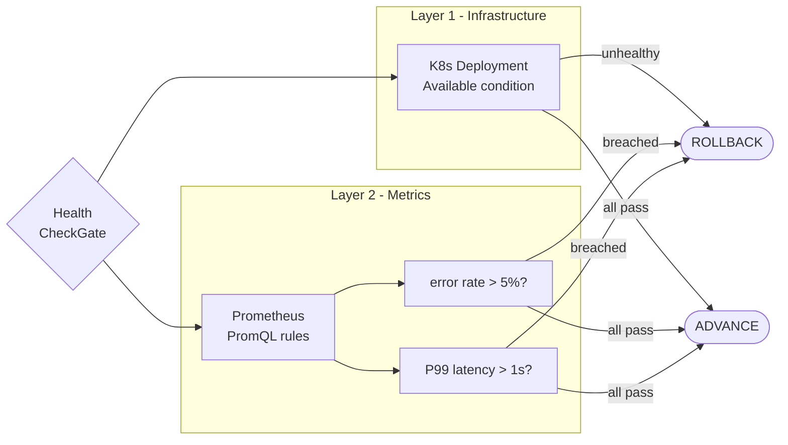
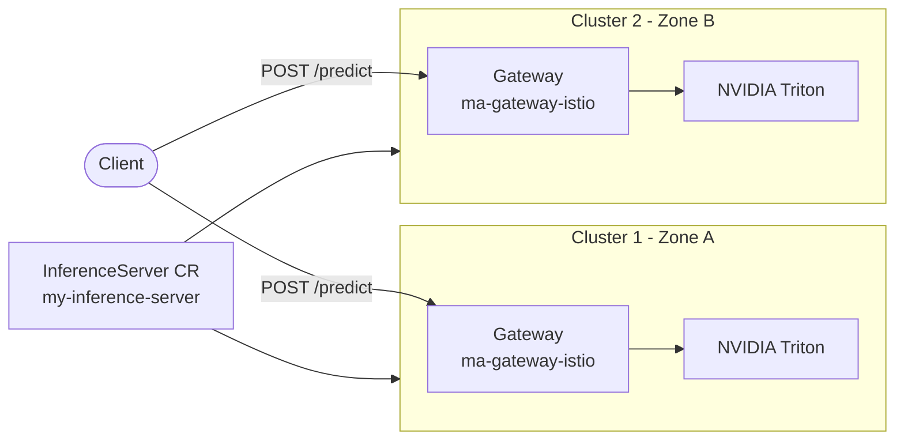

[](https://github.com/michelangelo-ai/michelangelo/releases)
[](http://www.apache.org/licenses/LICENSE-2.0)
[](https://codecov.io/gh/michelangelo-ai/michelangelo)
[](https://www.bestpractices.dev/projects/11481)

# Michelangelo-AI

Michelangelo-AI is an open-source **ML deployment control plane** — built to safely roll out models across multiple clusters, catch regressions via custom metrics, and recover automatically.

> :warning: **Beta** — APIs and features may evolve as we stabilize.

---

## The problem

Running a model on one cluster is solved. The hard part is:

- Rolling out a new model version **across many clusters** without a single bad deployment taking down production
- **Automatically rolling back** when your error rate spikes — not after an on-call wakes up
- Doing all of this with **NVIDIA Triton** as the serving runtime, with a pluggable backend interface for additional runtimes in the future

Michelangelo is the control plane that sits above your serving runtime and handles this.

---

## How it works

### CRD-based architecture

Everything is declarative Kubernetes CRDs managed by the Michelangelo controller:

```
Revision          →  what to deploy (model artifact + serving config)
InferenceServer   →  where to serve  (cluster targets, routing, gateway)
Deployment        →  how to roll out (strategy, health gates, rollback rules)
```



### Rollout strategies

Two strategies are supported. Choose based on resource constraints and risk tolerance.

#### Zonal (default) — one cluster at a time

Each cluster (zone) completes the full rollout sequence — including a configurable soak period — before the next cluster begins. If the health gate fails in cluster 1, cluster 2 is never touched.



#### Rolling — all clusters simultaneously

All clusters load the new model in parallel. Used when hosts cannot hold two model versions in memory at once (GPU memory constraints).

```
cluster-1 + cluster-2: load new model simultaneously → health gate → unload old model
```

No zone boundary. A bad model affects all clusters in the first batch.

### Health gate

Two layers evaluated on every reconcile during rollout:



Fail-open: if Prometheus is unreachable, the metric layer returns healthy — no spurious rollbacks.

---

## Model Serving

### InferenceServer

The `InferenceServer` CR declares where a model runs. It manages cluster registration, gateway routing, and TLS — independently of what serves the model:



```yaml
apiVersion: michelangelo.api/v2
kind: InferenceServer
metadata:
  name: my-inference-server
spec:
  clusterTargets:
    - clusterId: compute-1          # Zone A
      kubernetes:
        host: "https://compute-1.internal"
        port: 6443
      tokenTag: compute-1-token
      caDataTag: compute-1-ca
    - clusterId: compute-2          # Zone B
      kubernetes:
        host: "https://compute-2.internal"
        port: 6443
      tokenTag: compute-2-token
      caDataTag: compute-2-ca
```

### Serving runtime

The current backend is **NVIDIA Triton Inference Server**. The backend interface (`go/components/inferenceserver/backends/`) is pluggable — additional runtimes can be added by implementing the `Backend` interface.

| Runtime | Status | Notes |
|---|---|---|
| **NVIDIA Triton** | ✅ Supported | ONNX, TensorRT, PyTorch, TensorFlow |
| **vLLM** | Planned | Interface ready, implementation pending |
| **Custom** | Planned | Any HTTP inference endpoint |

---

## Deployment & Rollout

### Deployment CR — zonal strategy

Roll out one cluster at a time with a soak period. If health gates fail in zone A, zone B is never touched:

```yaml
apiVersion: michelangelo.api/v2
kind: Deployment
metadata:
  name: my-model-deployment
spec:
  desiredRevision:
    name: my-model-v2
  inferenceServer:
    name: my-inference-server
  definition:
    type: TARGET_TYPE_INFERENCE_SERVER
  strategy:
    zonal:
      rolloutPeriodInSeconds: 300   # soak 5 min per zone before advancing
  healthCheckConfig:
    prometheusUrl: "http://prometheus:9090"
    rules:
      - name: high-error-rate
        query: >-
          rate(triton_inference_request_failure_total{model="my-model"}[2m])
          / rate(triton_inference_request_total{model="my-model"}[2m])
        op: GT
        threshold: 0.05      # roll back if error rate > 5%

      - name: high-latency-p99
        query: >-
          histogram_quantile(0.99,
            rate(triton_inference_request_duration_seconds_bucket{model="my-model"}[2m]))
        op: GT
        threshold: 1.0       # roll back if P99 > 1s
```

**Supported operators:** `GT`, `LT`, `GTE`, `LTE`

### Force a rollback (for testing)

Inject an always-failing rule — controller rolls back within one reconcile cycle (~30s):

```bash
kubectl patch deployment my-model-deployment --type=merge -p '{
  "spec": {"healthCheckConfig": {"rules": [
    {"name":"force-rollback","query":"vector(1)","op":"GT","threshold":0}
  ]}}
}'
```

Clear to resume:

```bash
kubectl patch deployment my-model-deployment --type=merge -p '{
  "spec": {"healthCheckConfig": {"rules": []}}
}'
```

---

## Quickstart

### Prerequisites

```bash
brew install k3d kubectl helm
git clone https://github.com/michelangelo-ai/michelangelo.git
cd michelangelo/python && poetry install && source .venv/bin/activate
```

### Single-cluster sandbox

```bash
ma sandbox create
ma sandbox demo inference
```

### Multi-cluster sandbox (two zones)

```bash
# Creates control plane cluster + compute-1 (zone A)
ma sandbox create --create-compute-cluster

# Run a demo
ma sandbox demo inference   # InferenceServer multi-cluster demo
ma sandbox demo pipeline    # ML pipeline demo
ma sandbox demo kserve      # KServe + metric health gate demo
```

### KServe demo

`ma sandbox demo kserve` installs KServe on `michelangelo-compute-1` alongside the existing Michelangelo stack:

- cert-manager + KServe v0.13.1 in RawDeployment mode (no Knative required)
- Custom Triton `ClusterServingRuntime` for KServe
- `sklearn-iris` KServe `InferenceService` — managed by KServe directly

> **Note:** KServe and Michelangelo are independent in this demo. The `InferenceService` CR is applied directly to the cluster; Michelangelo does not manage it. Michelangelo's `Deployment` CR targets its own Triton `InferenceServer`. A native KServe backend for Michelangelo is planned.

Apply the Michelangelo deployment with Triton health gates:

```bash
kubectl apply -f python/michelangelo/cli/sandbox/demo/kserve/deployment-with-healthcheck.yaml
```

---

## ML Pipelines

Michelangelo also covers the training side of the lifecycle. Define DAGs with `@task` and `@workflow` decorators, backed by Temporal orchestration:

```python
import michelangelo.uniflow.core as uniflow

@uniflow.task()
def train(learning_rate: float = 0.01) -> str:
    return "model_path"

@uniflow.workflow()
def my_pipeline(learning_rate: float = 0.01):
    model = train(learning_rate=learning_rate)
```

See the [MovieLens NCF example](python/examples/movielens/) for a full end-to-end walkthrough with Ray Train + PyTorch Lightning.

---

## Documentation

- [Sandbox Setup](https://michelangelo-ai.org/docs/getting-started/sandbox-setup/)
- [Getting Started with ML Pipelines](https://michelangelo-ai.org/docs/user-guides/getting-started/getting-started)
- [User Guides](https://michelangelo-ai.org/docs/user-guides/)

## Contributing

We welcome contributions! See the [Contributing Guidelines](https://github.com/michelangelo-ai/michelangelo/blob/main/CONTRIBUTING.md).

## License

[Apache 2.0](https://github.com/michelangelo-ai/michelangelo/blob/main/LICENSE)

## Acknowledgments

Thank you to the Michelangelo Open Source team and all contributors.
