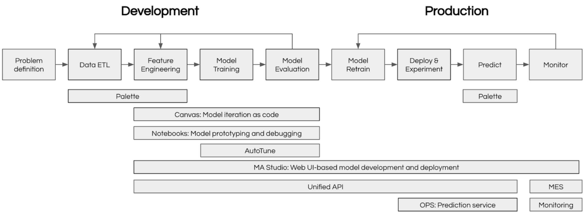

# About Michelangelo

Michelangelo ("MA") is Uber's machine learning platform.

## Why Michelangelo?

If you're an ML practitioner familiar with training models, managing experiments, and deploying to production, Michelangelo streamlines your entire workflow with:

### End-to-End ML Lifecycle Management
- **One platform** for data preparation, training, deployment, and monitoring - no need to stitch together multiple tools
- **Automatic versioning** for datasets, models, and experiments - reproducibility built in by default
- **Production-grade infrastructure** - benefit from Uber's scale-tested ML infrastructure without DevOps overhead

### Flexible Development Options
- **No-code UI** for rapid prototyping and standard workflows - perfect for quick experiments and business analysts
- **Code-driven workflows** for custom ML pipelines - full control when you need it with Canvas and Uniflow
- **Seamless transition** between UI and code - start in the UI, extend with code as needs grow

### Built for Collaboration
- **Shared artifact registry** - models, datasets, and experiments are discoverable across teams
- **Role-based access** - secure collaboration with fine-grained permissions
- **Integrated monitoring** - catch model drift and performance issues before users do

### Production-Ready from Day One
- **Scalable compute** - from single-GPU training to distributed Ray clusters
- **Enterprise deployment** - online serving, batch predictions, and streaming inference
- **Observability built-in** - metrics, logs, and traces for debugging production models

## Getting Started

Michelangelo offers 2 primary ways for you to build and deploy your model:

1. **User Interface (UI)** - No-code environment for standard ML workflows
2. **Canvas/Uniflow** - Code-driven workflows for advanced customization

### ML Workflow Mapping

If you're coming from other ML platforms, here's how familiar concepts map to Michelangelo:

| Your Workflow | Familiar Tool | Michelangelo Equivalent |
|---------------|---------------|-------------------------|
| **Data Preparation** | Pandas, Spark notebooks | **MA Studio Data Prep** or **Uniflow tasks** with Ray/Spark * |
| **Experiment Tracking** | MLflow, Weights & Biases | **Model Registry** with automatic versioning |
| **Model Training** | Custom scripts, Kubeflow Pipelines | **MA Studio Training** (UI) or **Canvas/Uniflow workflows** (code) |
| **Hyperparameter Tuning** | Optuna, Ray Tune | **Uniflow tasks** with Ray * |
| **Model Storage** | S3 buckets, model registries | **Michelangelo Model Registry** with metadata & lineage & plugin storage |
| **Batch Inference** | Airflow + custom scripts | **Deployment to batch endpoint** with offline inference pipeline and Ray / Triton Inference * |
| **Online Serving** | TorchServe, TensorFlow Serving | **Deployment to inference server** with Triton Inference Server * |
| **Monitoring** | Prometheus + Grafana | **Model Excellence Scores** + built-in dashboard * |
| **Pipeline Orchestration** | Airflow, Prefect, Temporal | **Uniflow workflows** with Cadence/Temporal backend * |
_* Can be replaced by the plugin system for custom integrations_

**Key Difference**: Instead of stitching together 5-10 separate tools, Michelangelo provides integrated components that work together seamlessly while still allowing you to drop down to code when needed.

### Choose Your Path

Pick the approach that matches your workflow and expertise:

#### 🎨 UI Path - Start Here If You:
- Want to **quickly experiment** with standard ML models (XGBoost, Classic ML, Deep Learning)
- Prefer **visual workflows** over writing code
- Are a **business analyst or product manager** building predictive models
- Need to **prototype rapidly** before investing in custom code

**Quick Start**:
1. Navigate to MA Studio in the UI
2. Create a new project and define your use case
3. Prepare your dataset using the Data Prep interface
4. Train a model using pre-built templates
5. Evaluate results and deploy

**Best for**: Classification, regression, time series forecasting with standard features

#### 💻 Code Path - Choose This If You:
- Need **custom ML pipelines** with specialized preprocessing
- Want **full control** over training loops, model architectures, or data transformations
- Are building **production-grade workflows** that need to run on schedules
- Have **complex dependencies** between multiple ML tasks
- Want to apply **software engineering practices** to ML (testing, version control, CI/CD)

**Quick Start**:
1. Install Michelangelo SDK: `pip install michelangelo`
2. Define your workflow using Uniflow decorators (`@uniflow.task`, `@uniflow.workflow`)
3. Test locally, then deploy to Michelangelo infrastructure
4. Monitor execution through the UI

**Best for**: Custom architectures, multi-stage pipelines, A/B testing frameworks, feature engineering at scale

#### 🔄 Hybrid Approach
Many teams start with the **UI for initial experiments**, then transition to **code for production workflows**. You can:
- Train initial models in the UI to validate feasibility
- Export configurations and rebuild in Canvas/Uniflow for production
- Use the UI for monitoring while managing training/deployment via code

## Machine Learning Tools

### Michelangelo User Interface (MA UI)
The UI environment provides a standard, code-free ML development experience. It guides users through the different phases of the ML development lifecycle. Uber's internal term for the UI is MA Studio (you may see it appear on this site in screenshots of the UI). This environment provides all the essential tools which allow ML developers to build, train, deploy, monitor, and debug your machine learning models in a single unified visual interface to boost your productivity. 

**Currently, Preparing and Training models are available for open source users. More features will be made available soon.**

Users can use the no-code dev environment to perform standardized ML tasks without writing a single line of code, including:
* Prepare data sources for training models or making batch predictions
* Build and train XGB models, classic ML models, and Deep Learning models

### Canvas: opinionated predefined ML workflow

For more advanced tasks, such as training DL models, setting up customized retraining workflows, building bespoke model performance monitoring workflows, users can build the corresponding pipelines via Canvas, an opinionated predefined ML workflow, while managing these pipelines (running, debugging, viewing run results, etc) in the UI environment. 

Canvas provides a highly customized, code driven ML development experience by applying software development principles to ML development. Users can create their own dependencies that can be managed in the UI environment.

## What Can I Build?

Michelangelo supports a wide range of ML use cases. Here are some common examples to inspire your first project:

### Classification & Prediction
- **Churn Prediction**: Identify customers likely to cancel subscriptions
  - _Approach_: Train XGBoost model in MA Studio UI with historical user behavior data
  - _Features_: Usage frequency, support tickets, payment history
  - _Deployment_: Batch predictions daily, results to business intelligence dashboard

- **Fraud Detection**: Flag suspicious transactions in real-time
  - _Approach_: Deep learning model via Canvas workflow
  - _Features_: Transaction patterns, device fingerprints, network analysis
  - _Deployment_: Online inference server with <100ms latency requirements

### Ranking & Recommendation
- **Content Recommendation**: Personalize content feeds for users
  - _Approach_: Multi-stage pipeline with candidate generation → ranking
  - _Features_: User preferences, content embeddings, interaction history
  - _Deployment_: Online serving with A/B testing framework

- **Search Ranking**: Improve search result relevance
  - _Approach_: Learning-to-rank model with custom loss function
  - _Features_: Query-document similarity, click-through rates, dwell time
  - _Deployment_: Hybrid batch (model updates) + online (inference)

### Time Series & Forecasting
- **Demand Forecasting**: Predict product demand for inventory planning
  - _Approach_: Time series model with external regressors
  - _Features_: Historical sales, seasonality, promotions, weather
  - _Deployment_: Scheduled batch predictions (weekly/monthly)

- **Anomaly Detection**: Monitor system metrics for unusual patterns
  - _Approach_: Unsupervised learning with custom Uniflow pipeline
  - _Features_: System logs, performance metrics, error rates
  - _Deployment_: Streaming inference with alerting

### Natural Language Processing
- **Sentiment Analysis**: Classify customer feedback sentiment
  - _Approach_: Fine-tuned transformer model (BERT/RoBERTa)
  - _Features_: Review text, ratings, metadata
  - _Deployment_: Batch processing for historical data, online for real-time feedback

- **Text Classification**: Categorize support tickets automatically
  - _Approach_: Multi-label classification with pre-trained embeddings
  - _Features_: Ticket description, user history, urgency signals
  - _Deployment_: Online inference integrated with ticketing system

### Computer Vision
- **Image Classification**: Categorize product images
  - _Approach_: Transfer learning from pre-trained CNN (ResNet, EfficientNet)
  - _Features_: Raw images + metadata
  - _Deployment_: Batch processing for catalog updates

**Not sure where to start?** Check out our [tutorials](../tutorials) with end-to-end examples, or explore the [Model Registry](../model-registry) to see what others have built.

## Architecture

### Ecosystem overview

At Uber, Machine Learning (ML) is critical because of the complexity and scale of all the decisions that we have to make. ML can reduce uncertainty in our processes, making our products more targeted and our user experience better. There are also so many factors and signals influencing our systems that we often need ML to make sense of what’s happening.

We make millions of predictions every second, and hundreds of applied scientists, engineers, product managers, and researchers work on ML solutions daily. Uber relies on a unique ecosystem (pictured below) of internal tooling to scale ML solutions with speed, accuracy, and reliability.



## Frequently Asked Questions

### Getting Started

**Q: Do I need to learn a new framework to use Michelangelo?**
A: No. If you're using the UI, it's entirely point-and-click. If you're coding, Michelangelo uses familiar tools:
- Python for model code (PyTorch, TensorFlow, scikit-learn, XGBoost all work)
- Ray for distributed computing
- Standard data formats (Parquet, CSV, JSON)
- Decorators (`@uniflow.task`, `@uniflow.workflow`) to integrate your existing code

**Q: Can I use my existing Python ML code?**
A: Yes! Wrap your training functions with `@uniflow.task()` decorator and you're ready to go. Example:
```python
@uniflow.task()
def train_model(data_path: str):
    # Your existing training code here
    model = train_my_model(data_path)
    return model
```

**Q: How do I migrate from my current ML stack?**
A: Start small:
1. Pick one model to migrate (not your most critical one)
2. Use Michelangelo's data prep → training → deployment workflow
3. Compare results with your existing pipeline
4. Gradually migrate more models as you gain confidence

### Data & Features

**Q: Where does my training data come from?**
A: Multiple sources:
- Upload CSV/Parquet files directly via UI
- Connect to data warehouses (Snowflake, BigQuery, Redshift)
- Use Spark/Ray for large-scale data processing
- Reference existing datasets in Michelangelo's data catalog

**Q: Can I use feature stores with Michelangelo?**
A: Yes, Michelangelo integrates with feature stores or you can manage features within the platform using the data prep pipelines.

**Q: What data formats are supported?**
A: Parquet (recommended), CSV, JSON, Avro. For custom formats, use Uniflow tasks to handle data loading.

### Training & Deployment

**Q: What compute resources are available?**
A: Michelangelo provides:
- CPU-only instances for lightweight models
- Single-GPU instances (V100, A100) for deep learning
- Multi-GPU clusters for distributed training
- Ray clusters for data-parallel and model-parallel training

**Q: How long does it take to deploy a model?**
A: Deployment time varies:
- Online inference: ~5-10 minutes (container build + rollout)
- Batch predictions: Immediate (scheduled jobs)
- Testing in sandbox: <2 minutes

**Q: Can I do A/B testing?**
A: Yes. Deploy multiple model versions to the same endpoint with traffic splitting. Monitor metrics per variant and gradually shift traffic to the winner.

**Q: What happens if my model training fails?**
A: Uniflow automatically:
- Retries transient failures (network issues, spot instance preemption)
- Preserves logs and intermediate outputs for debugging
- Sends notifications (email, Slack) on terminal failures

### Monitoring & Operations

**Q: How do I monitor model performance in production?**
A: Michelangelo provides:
- **Model Excellence Scores** tracking accuracy, latency, throughput
- **Data drift detection** comparing training vs. production distributions
- **Custom metrics** you define and track
- **Alerts** when metrics degrade beyond thresholds

**Q: Can I roll back a model deployment?**
A: Yes, instantly. Every deployment is versioned. Click "Rollback" in the UI or use the CLI:
```bash
ma deploy rollback --endpoint my-model --to-version 3
```

**Q: How do I debug predictions?**
A: Multiple approaches:
- **Request tracing**: See exact features used for a specific prediction
- **Batch debugging**: Run model on test inputs via UI
- **Local testing**: Pull deployed model and run locally with same inputs

### Cost & Scaling

**Q: How does Michelangelo handle scaling?**
A: Automatically:
- Online inference autoscales based on request volume
- Batch jobs use spot instances for cost savings
- Ray clusters elastically scale workers based on workload

**Q: What if my dataset doesn't fit in memory?**
A: Use Michelangelo's Ray integration for out-of-core processing. Data is streamed from storage (S3, HDFS) and processed in chunks.

### Collaboration & Governance

**Q: How do multiple team members collaborate?**
A: Michelangelo provides:
- **Shared projects** with role-based access (viewer, editor, admin)
- **Model lineage** tracking who trained what and when
- **Version control** for models, datasets, and pipelines
- **Comments and annotations** on experiments and deployments

**Q: Is my data secure?**
A: Yes. Michelangelo enforces:
- Role-based access control (RBAC)
- Encryption at rest and in transit
- Audit logs for all operations
- Compliance with SOC 2, GDPR, HIPAA (depending on deployment)

**Q: Can I use Michelangelo for regulated industries (healthcare, finance)?**
A: Yes, with proper configuration. Michelangelo supports:
- Data residency requirements (region-specific storage)
- Audit trails for model decisions
- Explainability tools for model interpretability

---

**Still have questions?** Check out our [documentation](../), join the [community forum](https://github.com/michelangelo-ai/michelangelo/discussions), or explore [example projects](../tutorials).
