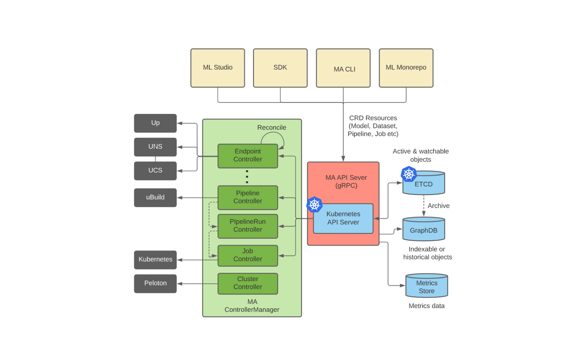
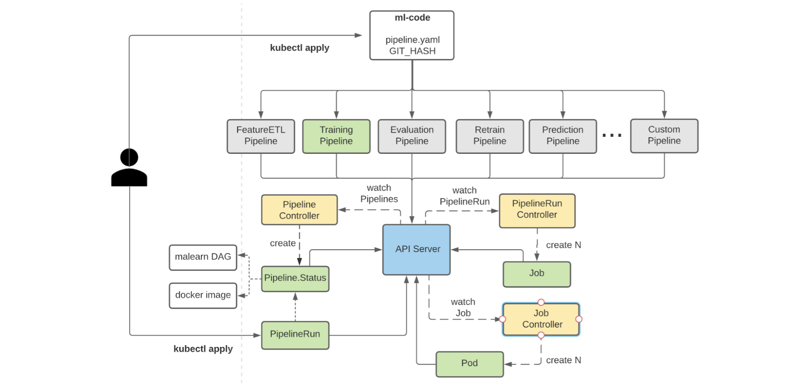

# Michelangelo API Framework

Michelangelo is an end-to-end ML platform designed to democratize machine learning and make scaling AI accessible across organizations. It enables ML practitioners to seamlessly build, deploy, and operate machine learning solutions at scale. Michelangelo is designed to cover the end-to-end ML workflow: manage data, train, evaluate, and deploy models, make predictions, and monitor predictions.

Michelangelo consists of a mix of open-source systems and components built in-house. We generally prefer to use mature open-source options where possible and will fork, customize, and contribute back as needed, though we sometimes build systems ourselves when open-source solutions are not ideal for a given use case.

An important piece of the system is Michelangelo API. This is the brain of the system. It consists of a management application that serves the web UI and network API. Currently, there is no industry-wide API standard for ML platforms and tooling, nor an end-to-end implementation reference available, and there’s no open-source initiative to tackle this problem. Teams and organizations tend to build their own APIs with no industry-wide agreed-upon standards, resulting in duplication of effort and incompatibility among ML products built by different teams.

Michelangelo has been field tested with highly complex real-world ML use cases at scale. The Michelangelo API Framework can help close this gap. We’d like to share our years of learning and experience building a highly scalable and reliable end-to-end ML platform with the ML community.

<!--
## Getting Started
See the [Tutorial](docs/tutorial.md) for step-by-step instructions to
start a local Michelangelo deployment and how to train and deploy an
example ML model locally.
-->

## Architecture

Michelangelo defines the APIs using Protobuf as the IDL and the
clients like UI, CLI and SDK can access the API via gRPC or
HTTP/JSON. Michelangelo will support three SDK bindings by default
including Python, Golang and Java. Any other language bindings
supported by gRPC should work as well.

For detailed Michelangelo API definition, see the API Reference (coming soon).

Figure below shows the high-level architecture of Michelangelo API
framework that consists of the following components:

### API Servers

**Kubernetes API Server:** A REST service that provides the standard
methods for each CRD type (API resource type). Controllers monitor the
creations / modifications of the CRD objects through the Kubernetes
API server. Michelangelo users cannot directly call Kubernetes API
server. Instead, they have to use Michelangelo API server (gRPC) or
Michelangelo CLI(ma) to use Michelangelo APIs.

**Michelangelo API Server:** A gRPC server. For standard declarative
API resources, Michelangelo API server is a gRPC to REST proxy. The
APIs that do not fit into the declarative design are implemented in
the Michelangelo API server such as Search APIs.

Kubernetes API server and MA API server will be packaged in the same
docker container. Both k8s API server and MA API server are
stateless. There can be multiple instances for high availability or
scalability.

### ETCD
ETCD is a strongly consistent key-value store that supports lock,
leader election, and watching changes.
 
All the API resources (CRD objects) are stored in a global ETCD
cluster. With API Hooks, API developers may store some of the API
resource data into other storage systems (e.g. mysql, S3), while
keeping the metadata in ETCD.

### Controller Manager
Each controller monitors one API resource type. It’s a
controller’s job to ensure that, for any given object, the actual
state of the world matches the desired state (specification) in the
object.

Currently, all the Michelangelo controllers are in a single process,
i.e. Michelangelo Controller Manager. There will be multiple
controller manager instances deployed into different availability
zones for high availability. But at any time there is only one
instance acting as the leader and others will be the followers.

Controller Manager uses ETCD to do the leader election (through
Kubernetes API server). Controller Manager is based on the Kubernetes open-source
framework, i.e. `controller-runtime`.

Figure below shows how different ML pipelines can be managed and
executed using the Michelangelo API Framework.

