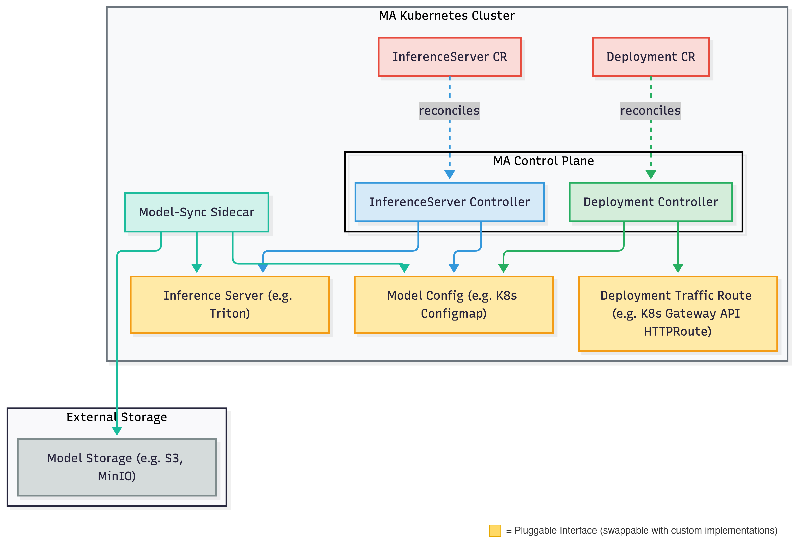

# Michelangelo AI Serving

Michelangelo AI provides a unified way to deploy and serve ML models on Kubernetes. This guide covers the architecture, controller lifecycles, and core concepts that operators and contributors should understand.

## **What Is Michelangelo AI Serving?**

Michelangelo AI Serving is a control plane for managing ML model serving infrastructure. It handles the complete lifecycle of inference servers and model deployments, from provisioning to traffic routing to cleanup.

Users define *what to deploy*, and Michelangelo AI handles:

* Provisioning inference server infrastructure (Deployments, Services)
* Managing model configurations
* Routing traffic to the correct models
* Health monitoring and status reporting
* Automatic cleanup on deletion

## **Architecture**

The image below displays the Michelangelo AI (MA) architecture for deploying and running inference on a model.

The system uses a **sidecar approach** for model management: a _model-sync_ sidecar daemon watches the model configuration and handles the actual loading and unloading of models on the inference server.

## **How Serving Works**

### InferenceServer Lifecycle

The InferenceServer controller manages the infrastructure that serves models:

1. **Create**
   User submits an InferenceServer resource.
2. **Provision**
   Michelangelo AI provisions the inference server infrastructure.
3. **Health Check**
   The system monitors deployment readiness and server health.
4. **Serve**
   Once healthy, the server is ready to load models.
5. **Delete**
   On deletion, all resources are cleaned up.

### Deployment Lifecycle

The Deployment controller manages model rollouts to inference servers. A rollout is a
progressive, cluster-by-cluster operation: the new model has to be loaded and verified on
every replica of a cluster before that cluster's traffic is switched, and a cluster has to
be serving the new model healthily before the next cluster starts.

1. **Validation**
   Michelangelo AI validates the model and target server.
2. **Asset Preparation**
   Model artifacts are staged for loading.
3. **Placement**
   The set of target clusters is snapshotted so the rest of the rollout works on a
   stable list.
4. **Per-cluster rollout** (repeated for each target cluster, in order)
   1. *Canary*: the model is loaded on a single replica and must report `READY` there.
   2. *Rolling load*: every replica of the cluster loads the model; the controller reads
      each replica's load state back from the serving framework and waits until all of
      them are `READY`. A replica that fails the load, or a load that exceeds its budget,
      fails the rollout.
   3. *Traffic switch*: the model becomes a readiness requirement for the replicas, all
      replicas are re-verified, and only then is the cluster's route flipped to the new
      model.
   4. *Soak*: the cluster serves the new model for a configurable period while the health
      and metric gates keep watching it.
5. **Discovery Routing**
   The model is exposed on the control-plane discovery route.
6. **Cleanup**
   The previous model is removed from every cluster's Model Config.
7. **Completion**
   The model is fully deployed and serving.

### Rollout Stages

Each step is a condition on the Deployment status. Per-cluster conditions carry the
cluster ID as a suffix (`RollingRolloutComplete-compute-1`).

| Condition | What must be true before the next step |
| ----- | ----- |
| `Validated` | Model and server configuration verified |
| `AssetsPrepared` | Model artifacts staged |
| `PlacementPrepared` | Target cluster snapshot recorded |
| `CanaryRolloutComplete-<cluster>` | Model `READY` on one running replica (Model Config phase `canary`) |
| `RollingRolloutComplete-<cluster>` | Model `READY` on every replica (phase `staged`), within `deployment.rollout.modelLoadTimeout` |
| `TrafficRoutingConfigured-<cluster>` | Entry promoted to phase `serving`, every replica re-verified, route flipped |
| `SoakComplete-<cluster>` | Cluster served the model for `deployment.rollout.soakPeriod` with the gates passing |
| `DiscoveryRoutingConfigured` | Discovery route configured |
| `ModelCleanupComplete-<cluster>` | Previous model removed from the cluster's Model Config |
| `RolloutComplete` | Model is live |

### Health Gates and Rollback

While a rollout is in progress the controller evaluates a health gate on every
reconcile. The gate fails when a model this Deployment is serving (a `serving` entry in
the model config) is not loaded on every replica in any target cluster, or when a
configured Prometheus metric gate is breached for the candidate model (by default, Triton's
inference failure ratio over the last five minutes). Only the Deployment's own models are
judged, so another Deployment's model that is still loading on the same inference server
does not roll this Deployment back. The reason for the last failed gate is recorded on the
Deployment in the `deployment.michelangelo.ai/health-gate-reason` annotation.

A rollback starts when the gate fails, when the desired model changes mid-rollout, or when
the rollout itself fails (a replica cannot load the model, or a load or canary exceeds its
budget). Rollback is also per cluster:

| Condition | Description |
| ----- | ----- |
| `RollbackComplete-<cluster>` | Previous model re-added as `serving` if needed and confirmed `READY` on every replica, route restored to it, candidate entry removed. With no previous model the route is removed instead. |
| `RollbackComplete` | Discovery route reconciled; the Deployment reports **Rollback Complete** |

Once a rollback has started it runs to completion even if the gate recovers, so a
transiently healthy signal cannot resume a rollout that was already being undone.

### Rollout Configuration

The knobs live in the controller manager config (`go/cmd/controllermgr/config/base.yaml`):

| Key | Default | Purpose |
| ----- | ----- | ----- |
| `deployment.rollout.skipCanary` | `false` | Skip the single-replica canary step |
| `deployment.rollout.modelLoadTimeout` | `15m` | Budget for a cluster to load the model on every replica |
| `deployment.rollout.soakPeriod` | `0` | Time a cluster serves the new model before the next cluster starts. A `Zonal` strategy's `rolloutPeriodInSeconds` overrides it |
| `deployment.rollback.modelLoadTimeout` | `15m` | Budget for the previous model to be `READY` again during a rollback |
| `deployment.metricGate.prometheusURL` | unset | Enables the metric gate when set |
| `deployment.metricGate.queries` | Triton failure ratio > 5% | PromQL templates (`{{.Model}}`, `{{.Deployment}}`, `{{.Namespace}}`, `{{.InferenceServer}}`) with a threshold and comparison |
| `deployment.metricGate.failClosed` | `false` | Treat an unanswerable query as a breach |
| `inferenceServer.triton.readinessProbe` | `model-aware` | `model-aware` requires every `serving` model to be loaded before a replica is ready; `server` uses Triton's server readiness; `none` disables the probe |
| `inferenceServer.triton.probes.{startup,liveness,readiness}.{periodSeconds,timeoutSeconds,failureThreshold}` | built-in per probe | Overrides the Triton pod probe timing; zero keeps the built-in value. Changing a value restarts running Triton pods once |
| `inferenceServer.triton.drain.{preStopSeconds,exitTimeoutSeconds}` | `10` / `30` | How a replaced Triton pod shuts down: `preStopSeconds` delays SIGTERM until the pod has left the Service endpoints, `exitTimeoutSeconds` is how long Triton waits for in-flight requests after SIGTERM. The pod's termination grace period is their sum plus 5s |

The `Blast` strategy skips the canary and the soak; use it only for emergency rollouts.

Errors a retry can clear (an unreachable cluster, a failed ConfigMap or HTTPRoute update, a
failed pod-proxy call) do not fail the rollout straight away. The step reports *in progress*
and is retried until its budget, counted from the step's first attempt, is spent:
`deployment.rollout.modelLoadTimeout` for the canary, rolling load and traffic switch, and
`deployment.rollback.modelLoadTimeout` for a rollback. Only then does it fail. A replica that
reports a failed load, a model that cannot be resolved and a denied pod proxy fail at once.

Operational notes:

* The model-aware readiness probe runs `python3` inside the Triton container. Images
  without it should set `readinessProbe: server`.
* Reading load state per replica uses the Kubernetes API server's pod proxy, so the
  controller's service account needs `pods` (get/list/watch) and `pods/proxy`
  (get/create) in every target cluster.
* Upgrading to this version changes the Triton pod template (readiness probe, drain
  settings and a spec hash annotation), which restarts existing Triton pods once. Pods
  replaced by a template change now drain: they stay in the pool for `preStopSeconds` after
  leaving the Service endpoints and Triton finishes in-flight requests before exiting, so a
  rolling restart does not drop requests.
* The drain `preStop` hook runs `sleep` in the Triton container; images without it should
  set `drain.preStopSeconds` to a value their shell supports or use an image that has it.

## **Core Concepts**

### InferenceServer

An InferenceServer represents the infrastructure for serving models. It includes:

* **Backend Type**: The serving framework (Triton, vLLM, etc.)
* **Resource Spec**: CPU, memory, GPU requirements
* **Replicas**: Number of server instances

### Deployment

A Deployment represents a model being served on an inference server. It includes:

* **Target Server**: The InferenceServer to deploy to
* **Model Revision**: The model version to serve
* **Rollout Strategy**: How to deploy (progressive or emergency)

### Model Config

The model config stores the list of models to be loaded on an inference server. It acts as a decoupling layer between the controllers and the inference server itself so that controllers never need to interact with the serving framework or storage backends directly. The InferenceServer controller owns the model config lifecycle (creation and deletion), while the Deployment controller manages individual model entries (adding and removing models during rollouts and rollbacks). The _model-sync_ sidecar watches this config and reconciles the inference server's state by downloading models from external storage and loading or unloading them via the serving framework's API. Example implementation: Kubernetes ConfigMap.

Each entry carries a rollout `phase` that tells the sidecar where a model belongs:

| Phase | Loaded on | Readiness |
| ----- | ----- | ----- |
| `canary` | Only the replica named in `canary_pod` | Not required |
| `staged` | Every replica | Not required |
| `serving` (default) | Every replica | Required by the model-aware readiness probe |

The Deployment controller moves an entry through these phases during a rollout and reads the resulting load state back per replica, which is what makes "the model is loaded" mean "every replica serves it" rather than "one replica answered".

### Traffic Route

Traffic routes manage traffic routing from the gateway to specific models on the inference server. Example implementation: Gateway API HTTPRoute.

## gRPC API Services

The following gRPC services back the serving control plane. All are defined in `proto/api/v2/` and accessible via the Michelangelo AI API server.

| Service | Proto file | Purpose |
|---|---|---|
| `InferenceServerService` | `inference_server_svc.proto` | Lifecycle management for InferenceServer resources — provision, health-check, scale, delete |
| `DeploymentService` | `deployment_svc.proto` | Model rollout management — stages, traffic routing, rollback |
| `RevisionService` | `revision_svc.proto` | Manages Revision resources — immutable snapshots of a Deployment configuration |
| `ClusterService` | `cluster_svc.proto` | Manages compute Cluster registrations available to the serving control plane |
| `RayClusterService` | `ray_cluster_svc.proto` | Manages Ray-specific cluster resources provisioned for inference workloads |

Each service follows the standard CRUD pattern (Create, Get, List, Update, Delete) and also exposes `DeleteXxxCollection` for bulk deletion. See the [full API reference](../../api-reference/grpc/serving.md) for complete request/response schemas.

## Next Steps

* [Full gRPC API Reference](../../api-reference/grpc/serving.md): Complete RPC and field reference for these five services
* [Run Inference on a Local Sandbox](./cluster-setup.md): Try inference in a local development environment
* [Integrate with Your Custom Backend](./integrate-custom-backend.md): Add support for new serving frameworks
