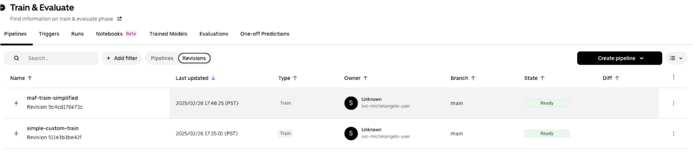
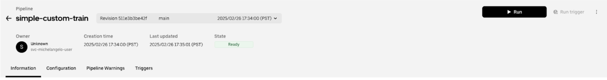

# Standard vs. Custom Workflows

In general, there are two categories of Michelangelo pipelines: those that leverage the **standard workflows** and those that depend on user-created **custom workflows**. 

The **standard workflows** are a set of workflows provided and managed by Michelangelo meant to address some common use cases, such as model training (for either in-house or custom models), model prediction and evaluation, and embedding generation. 

The **custom workflows** are completely user-defined and can be used for some exceptional use cases that are not supported by the standard workflows. 

The Michelangelo team manages the tooling for building and executing the custom workflows but does not manage the workflow definitions for the custom workflows. Pipelines with both standard and custom workflows can be executed and managed in MA Studio.

### Workflow Feature Comparison

Feature | Standard Workflow | Custom Workflow
--- | --- | ---
MA Studio UI support | ✅ | ✅
Triggering the pipeline via MA Studio | ✅ | ✅
Triggering the pipeline via ma in CLI | ✅ | ✅
Remote run (via Spark/Ray clusters) | ✅ | ✅
Local run | ✅ | ✅
Resume from previous steps | ✅ | ✅
Apply local diff in the remote pipeline run | **TBD** | **TBD**
Support a mixture of Ray/Spark tasks | ✅ | ✅
Orchestration support | ✅ | ✅
Constant overwrite | **TBD** | **TBD**
Automatic docker building | ✅ | **TBD**
Override the tasks with custom tasks | ✅ | ✅
Pipelines defined by YAML config | ✅ | ✅
Pipelines defined by Python scripts | ❌ | ✅
Created/updated via MA Studio UI | ✅ (with exceptions) | ❌

# Standard Workflows

The standard workflows are a set of workflows provided and managed by Michelangelo meant to address some common use cases. The pipelines of these workflows are defined in a YAML format inside the pipeline_conf.yaml file.

# Custom Workflows

The custom workflows are fully customized Uniflow workflows.

# Pipeline Creation

An MA Studio project is required before creating pipelines. Please refer to [Project Management](https://github.com/michelangelo-ai/michelangelo/wiki/project-management-for-ml-pipelines) for project creation.

## Pipeline Creation for Standard Workflows 

### Folder Structure

To create a pipeline, we must create a directory under the project folder with the following structure.

```
<pipeline folder>
    pipeline_conf.yaml
    pipeline.yaml
```

### pipeline.yaml

The **pipeline.yaml** file defines the metadata for the pipeline. This file is required to register the pipeline with MA Studio. The format of the **pipeline.yaml** file conforms to this protobuf. 

```
apiVersion: michelangelo.uber.com/v2beta1
kind: Pipeline
metadata:
  namespace: ma-dev-test-uber-one    # The name of the project
  name: simple-custom-train          # The name of the pipeline

spec:
  type: PIPELINE_TYPE_TRAIN
  manifest:
    path: pipeline_conf.yaml         # For standard workflows, the manifest path is always pipeline_conf.yaml
```

### pipeline_conf.yaml

The **pipeline_conf.yaml** file contains the configuration for the pipeline.

#### Example

**pipeline_conf.yaml**

```
workflow_function: uber.ai.michelangelo.sdk.workflow.defs.tabular_train.workflow_function
workflow_config: {}
task_configs:
  tabular_feature_prep:
    config:
      source:
        dataset:
          namespace: ma-dev-test-uber-one
          name: boston-housing
      split:
        ratio:
          train_ratio: 0.8
  tabular_trainer:
    config:
      custom:
        train_class: !py_import uber.ai.michelangelo.projects.ma_dev_test_uber_one.pipelines.custom.simple.lib.simple_trainer.SimpleTrainer
  tabular_assembler:
    config:
      model_class: !py_import uber.ai.michelangelo.projects.ma_dev_test_uber_one.pipelines.custom.simple.lib.simple_model.SimpleModel
  tabular_inference:
    config: {}
  evaluator:
    task_function: !py_import uber.ai.michelangelo.projects.ma_dev_test_uber_one.pipelines.custom.simple.lib.simple_evaluator.SimpleEvaluator
    config: {}
  pusher:
    config:
      items:
        - name: model
          model_plugin:
            model_kind: custom
            model_family: ma-dev-test-uber-simple
            model_description: "test custom model"
        - name: train_inference_result
          dataset_plugin: {}
        - name: validation_inference_result
          dataset_plugin: {}
        - name: test_inference_result
          dataset_plugin: {}
```

## Pipeline Creation for Custom Workflows

### Typical Code Structure

```
<project root>
├── config
│   └── project.yaml
├── lib
│   └── ...
├── METADATA
├── pipelines
│   └── <pipeline_name>
│       ├── pipeline.py    # The entry point for the pipeline. It imports and triggers the workflow function.
│       └── pipeline.yaml
│       └── ...
├── tasks
│   └── <task_name>
│       ├── __init__.py
│       ├── BUILD.bazel
│       └── task.py        # This contains the task function
│       └── ...
└── workflows
    └── <workflow_name>
        ├── BUILD.bazel
        └── workflow.py    # This contains the workflow function
        └── ...
```

### Define Custom Workflows

The workflow function defines the execution flow. It typically invokes the tasks in a certain order. In the remote run, the workflow function is triggered in Cadence. 

```
from uber.ai.uniflow.core import workflow
from ... import task1
from ... import task2

@workflow
def workflow_name(...):
    task1(...)
    task2(...)
```

### Define the Tasks

The task function is to be executed in either Ray or Spark.  

```
# task.py
from uber.ai.uniflow.core import task
from uber.ai.uniflow.ray_task import Ray

@task(config=Ray(... ray configs ...))
def task_name(...):
    ...
```

### Define the Pipeline

#### Folder Structure

```
\<pipeline folder>  
	pipeline.py  
	pipeline.yaml
```

#### pipeline.yaml

The **pipeline.yaml** file defines the metadata for the pipeline. This file is required to register the pipeline with MA Studio. The format of the **pipeline.yaml** file conforms to this protobuf.

Example: 
``` 
apiVersion: michelangelo.uber.com/v2beta1
kind: Pipeline
metadata:
  namespace: ma-dev-test-uber-one    # The name of the project
  name: simple-custom-train          # The name of the pipeline
  annotations:
    michelangelo/uniflow-image: uber-one-ma-dev-test-uber-one:bkt1-produ-1736545535-5f829  # The docker image used for the tasks

spec:
  type: PIPELINE_TYPE_TRAIN
  manifest:
    path: //uber/foo/bar:pipeline    # The manifest path is the bazel target corresponds to the pipeline.py file
```

#### pipeline.py

The **pipeline.py** file triggers the workflow function with a set of parameters.

##### Example

```
from uber.ai.uniflow import create_context
from foo.bar.workflows.my_workflow.workflow import my_workflow

if __name__ == "__main__":
    ctx = create_context()

    ctx.run(
        my_workflow,
        ...              # pass the parameters of the workflow in here
    )
```

# Pipeline Registration 

The pipeline registration is required to execute the pipeline remotely through MA Studio. Registering and running the pipeline in Canvas is similar to Canvas. Most of the commands in ManageandLaunchPipelinesUsingma, can still be used in Canvas.

**Register the Pipeline**  

```
ma pipeline apply \-f \<pipeline.yaml path>
```

# Pipeline Execution 

## Remote Run 

### Run the Pipeline from UI

After the pipeline is registered in MA Studio, it is displayed in the pipeline list page in MA Studio.




Click into the pipeline and click the Run button.




### Run the Pipeline using ma

If the pipeline is registered from the main branch. A new pipeline revision is created under the main branch, and the default revision for the pipeline is updated to the new revision. Therefore, you can run the pipeline directly.

```
ma pipeline run \--namespace=\<namespace> \--name=\<pipeline_name>
```

#### Example

```
ma pipeline run \--namespace=ma-dev-test-uber-one \--name=simple-custom-train
```

### Run the Pipeline Revision using ma

If the pipeline is registered from a remote private branch. A new pipeline revision is created under the private branch, and the default revision for the pipeline is not updated. Therefore, you should run the pipeline with the revision.

```
ma pipeline run -n <namespace> --revision <pipeline_revision_name>
```

**Example**

```
ma pipeline run -n ma-dev-test-uber-one --revision pipeline-simple-custom-train-511e3b3be42f
```