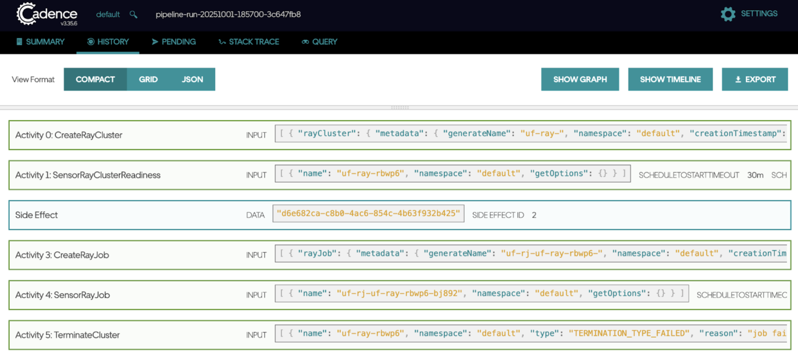

# Set Up Triggers

## What You'll Learn

* How to configure cron-based recurring run triggers within a single pipeline revision  
* How to configure ad-hoc backfill triggers within a single pipeline revision

## Setting Up a Cron Trigger

### 1\. Register the Pipeline

The trigger system requires you to register the pipeline first, and then configure the trigger run using the pipeline information. Before defining a trigger, the pipeline must be registered, which creates the pipeline entity with the latest revision. The trigger must then be linked to a specific, versioned pipeline.

### 2\. Set Up trigger.yaml

The trigger configuration is defined in a YAML file as a TriggerRun Custom Resource. This file binds the scheduling policy (Cron) to the registered pipeline revision.

A **TriggerRun** example demonstrates binding a cron schedule and execution parameters to a pipeline revision:

| Field | Example Value | Description |
| :---- | :---- | :---- |
| `apiVersion` | `michelangelo.api/v2` | API version |
| `kind` | `TriggerRun` | Specifies the resource type |
| `metadata.name` | `training-pipeline-cron-trigger` | Name of the trigger instance |
| `metadata.namespace` | `ma-dev-test` | Target namespace |
| `spec.pipeline` | `name: training-pipeline`, `namespace: ma-dev-test` | References the target Pipeline |
| `spec.pipeline.revision` | `name: <revision-name>` | References the specific Pipeline revision |
| `spec.trigger.cronSchedule.cron` | `"* * * * *"` | Cron expression (e.g., run every minute for testing) |
| `spec.trigger.cronSchedule.maxConcurrency` | `1` | Limits simultaneous runs |
| `spec.trigger.parametersMap` | `param1`, `param2` | Defines dynamic parameters/arguments passed to the pipeline. |

### 

### What are Parameter IDs?

Parameter IDs represent configurations utilized for scaling up trigger runs. For instance, suppose you need to execute an orchestration pipeline across 700+ cities, each with its unique configuration. In such cases, you aim to consolidate all 700 cities' configurations into a single pipeline while managing them separately. This is achieved by specifying the configurations for all 700+ cities within a dynamic parameter defined in the trigger file. 

### 3\. Use CLI Tool to Register Trigger

After trigger.yaml is created with corresponding trigger configuration, users manage TriggerRuns using CLI tools(mactl) after the environment prerequisites are met (sandbox creation, namespace setup, etc.). 

| Action | Example CLI Command |
| :---- | :---- |
| **Create Cron Trigger** | `ma trigger_run apply --file=<path_to_trigger.yaml_file>` |
| **Get Trigger Status** | `ma trigger_run get --namespace=<ns> –name=<name>` |
| **Kill Trigger** | `ma trigger_run kill --namespace=<ns> --name=<name>` |

### 4\. Check Recurring Run Through UI

Once registered, the trigger controller begins executing the recurring schedule. Users can monitor this activity using the MA Studio UI and the underlying workflow execution engine UI (Cadence/Temporal).

* **Monitor in MA Studio UI:** Access the MA Studio UI (e.g. [*`http://localhost:8090/ma-dev-test`*](http://localhost:8090/ma-dev-test))*. The cron trigger should appear under the Triggers section, showing a running state and recent pipeline runs being generated.

* **Monitor in Workflow Engine UI (Cadence/Temporal):**  
  * Access the Cadence UI (e.g. [*`http://localhost:8088/domains/default`](http://localhost:8088/domains/default/)*) or Temporal UI (e.g. [*`http://localhost:8080/domains/default/`](http://localhost:8080/domains/default/)*).  
  * The cron trigger will be represented by an "Open" or "Running" trigger workflow (e.g., `trigger.CronTrigger`).  
  * This trigger workflow continuously generates **child pipeline runs** based on the configured cron setting. Successful end-to-end tests verify that the pipeline runs are created and executed successfully.

## Setting Up a Backfill Trigger

The process for setting up a backfill trigger follows the same steps (1\~4) used to configure a recurring (cron) run, with one key difference: you must specify the execution time window using start and end timestamps. Currently, backfill triggers are created through trigger.yaml using these timestamp fields. In the future, all ad-hoc run triggers will be supported exclusively through the UI. For now, in **Step 2** of *trigger.yaml*, users need to include the following fields:

| Field | Example Value | Description |
| :---- | :---- | :---- |
| `spec.startTimestamp`  | `"2024-03-23T09:00:00Z"` | This field defines the **beginning** of the historical time interval over which the backfill should run. It is an **inclusive** boundary. If multiple runs are desired, users must choose a correct interval to ensure the cron cycle is included. |
| `spec.endTimestamp` | `"2024-03-23T09:15:00Z"` | This field defines the **end** of the historical time interval. The backfill trigger automatically catches all cron running cycles between the start and end time frames. This boundary is also **inclusive**; setting the end timestamp to the exact scheduled time will still kick off that run. |

### What is the start timestamp and end timestamp in the backfill trigger?

Start timestamp and end timestamp are time intervals where the user configures in running a backfill trigger. Backfill trigger automatically catches all cron running cycles between these 2 time frames. For example, in the backfill trigger where cron schedule is **"00 9 \* \* 6"** that triggers at 9am on Saturday, the start timestamp is **"2024-03-23T09:00:00Z"** and the end timestamp is **"2024-03-23T09:15:00Z"**. So it backfills one run happening at  **"2024-03-23T09:00:00Z"** (Saturday at 9am). If the user wants to backfill multiple runs in the previous time interval, then they need to choose the correct time interval for start timestamp and end timestamp, make sure cron cycle is included.