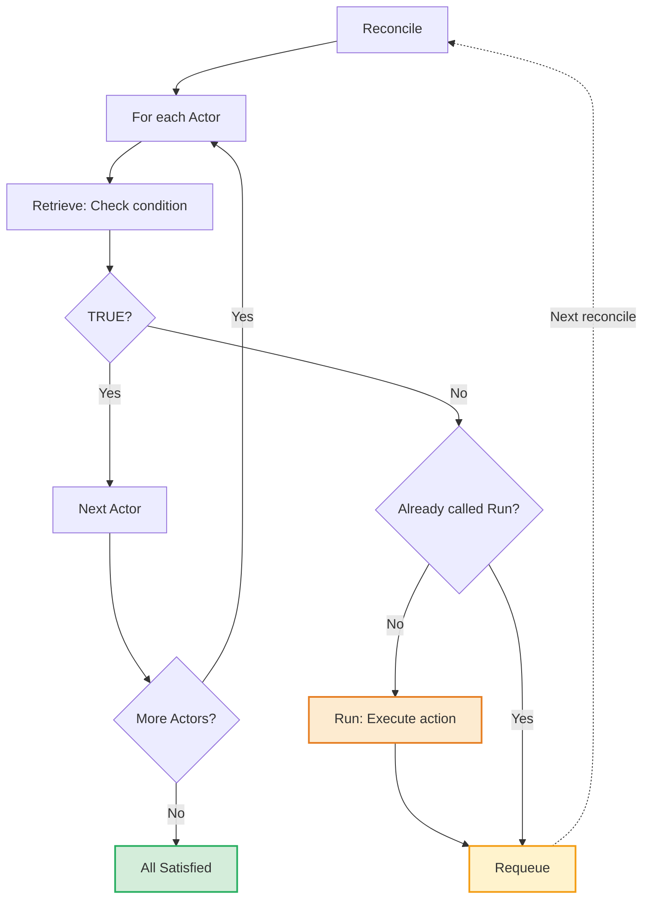

# Condition Engine Architecture

The Condition Engine is a core component that executes plugin actors sequentially and manages resource state transitions. It is used by controllers (Deployment, InferenceServer) to drive their reconciliation logic.

## How the Condition Engine Works

**Key insight**: Each Actor's `Run()` is called exactly **once**. On subsequent reconciles, only `Retrieve()` is called to poll until the condition becomes TRUE. Once TRUE, the engine advances to the next Actor.

## Key Concepts

| Concept | Description |
|---------|-------------|
| **Actor** | A unit of work that checks a condition (`Retrieve`) and optionally performs an action (`Run`) |
| **Plugin** | Provides an ordered list of Actors and manages conditions on the resource |
| **Condition** | A status (TRUE, FALSE, UNKNOWN) associated with an Actor type |
| **Critical Condition** | The condition returned by the first non-satisfied Actor's `Run` method |

## Condition Statuses

| Status | Meaning | Engine Behavior |
|--------|---------|-----------------|
| `TRUE` | Condition is satisfied | Skip to next Actor |
| `FALSE` | Condition failed permanently | Terminal state, no requeue |
| `UNKNOWN` | Condition in progress | Requeue to check again |

## Execution Rules

1. **Sequential Execution**: Actors are processed in order from the Plugin's `GetActors()` list
2. **Single Action Per Reconcile**: Only the first non-satisfied Actor's `Run()` is called per reconcile loop
3. **All Retrieve First**: Even after an action runs, remaining Actors still have `Retrieve()` called to update their conditions
4. **Terminal on Error**: Any error from `Retrieve()` or `Run()` results in a terminal state
5. **Terminal on FALSE**: A condition with status FALSE is terminal (unless reason is "killed")

## Result Types

| Result | AreSatisfied | IsTerminal | Description |
|--------|--------------|------------|-------------|
| All Satisfied | `true` | `true` | All Actors returned TRUE |
| Requeue | `false` | `false` | Action ran, condition still UNKNOWN |
| Failed | `false` | `true` | Condition returned FALSE |
| Killed | `false` | `true` | Workflow was externally terminated |
| Error | `false` | `true` | Retrieve or Run returned an error |
