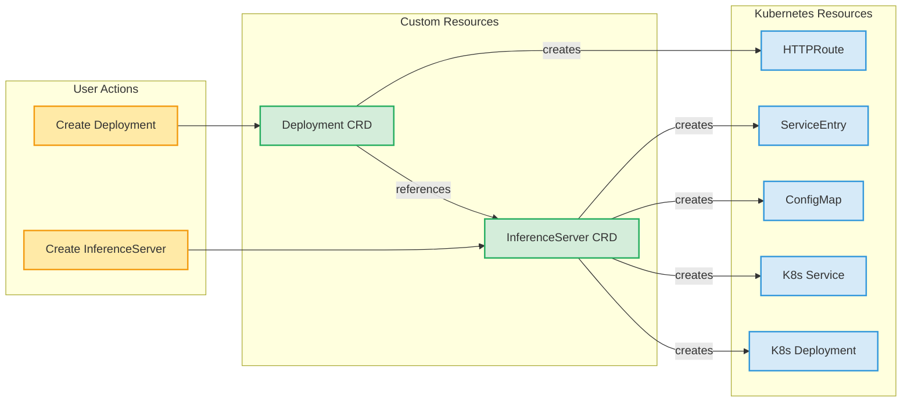

# Michelangelo Controller Architecture Overview

This document provides a high-level overview of the Michelangelo controller architecture, showing how the Deployment and InferenceServer controllers work together to manage ML model serving infrastructure.

## System Overview

```mermaid
flowchart TB
    subgraph Controllers["Controllers"]
        direction LR
        DC[Deployment Controller]
        ISC[InferenceServer Controller]
    end

    subgraph DeploymentPlugins["Deployment Plugins"]
        direction LR
        RP[Rollout Plugin]
        RBP[Rollback Plugin]
        CP[Cleanup Plugin]
        SSP[SteadyState Plugin]
    end

    subgraph InferenceServerPlugins["InferenceServer Plugins"]
        direction LR
        CrP[Creation Plugin]
        DelP[Deletion Plugin]
    end

    subgraph Interfaces["Interfaces"]
        direction LR
        subgraph PP["ProxyProvider «interface»"]
            direction TB
            PP1[EnsureDeploymentRoute]
            PP2[CheckDeploymentRouteStatus]
            PP3[RemoveDeploymentRoute]
        end

        subgraph BE["Backend «interface»"]
            direction TB
            BE1[CreateServer]
            BE2[GetServerStatus]
            BE3[DeleteServer]
            BE4[IsHealthy]
            BE5[CheckModelStatus]
        end

        subgraph MC["ModelConfig «interface»"]
            direction TB
            MC1[CreateModelConfig]
            MC2[DeleteModelConfig]
            MC3[AddModel]
            MC4[RemoveModel]
        end
    end

    subgraph K8sCluster["☸ Kubernetes Cluster"]
        direction LR
        ISF["Inference Server Framework\n(e.g. Triton)"]
        MCM[Model ConfigMap]
        HR[HTTPRoute]
        MSS["Model-Sync Sidecar"]
    end

    subgraph External["External Storage"]
        MS["Model Storage\n(e.g. S3, GCS)"]
    end

    DC --> RP
    DC --> RBP
    DC --> CP
    DC --> SSP

    ISC --> CrP
    ISC --> DelP

    RP --> BE
    RP --> PP
    RP --> MC
    RBP --> BE
    RBP --> MC
    CP --> BE
    CP --> PP
    CP --> MC
    SSP --> BE

    CrP --> BE
    CrP --> MC
    DelP --> BE
    DelP --> MC

    BE -->|provisions/deletes| ISF
    BE -->|health check| ISF
    BE -->|model status| ISF

    MC -->|creates/deletes| MCM
    MC -->|add/remove models| MCM

    PP -->|creates/deletes| HR

    MSS -->|watches| MCM
    MSS -->|downloads models| MS
    MSS -->|load/unload models| ISF
    classDef dcNode fill:#d4edda,stroke:#27ae60,stroke-width:2px
    classDef iscNode fill:#d6eaf8,stroke:#3498db,stroke-width:2px
    classDef resourceNode fill:#ffeaa7,stroke:#f39c12,stroke-width:2px

    class DC,RP,RBP,CP,SSP dcNode
    class ISC,CrP,DelP iscNode
    class ISF,MCM,HR resourceNode
    
    classDef sidecarNode fill:#d1f2eb,stroke:#1abc9c,stroke-width:2px
    classDef storageNode fill:#d5dbdb,stroke:#7f8c8d,stroke-width:2px
    
    class MSS sidecarNode
    class MS storageNode
    style PP fill:#f8d7da,stroke:#e74c3c,stroke-width:2px
    style BE fill:#fdebd0,stroke:#e67e22,stroke-width:2px
    style MC fill:#e8daef,stroke:#8e44ad,stroke-width:2px
    style K8sCluster fill:#f8f9fa,stroke:#6c757d,stroke-width:2px

    %% Deployment Controller arrows - Green
    linkStyle 0,1,2,3 stroke:#27ae60,stroke-width:2px
    %% InferenceServer Controller arrows - Blue
    linkStyle 4,5 stroke:#3498db,stroke-width:2px
    %% Backend arrows - Orange
    linkStyle 6,9,11,14,15,17,19,20,21 stroke:#e67e22,stroke-width:2px
    %% ProxyProvider arrows - Red
    linkStyle 7,12,24 stroke:#e74c3c,stroke-width:2px
    %% ModelConfig arrows - Purple
    linkStyle 8,10,13,16,18,22,23 stroke:#8e44ad,stroke-width:2px
    %% Model-Sync Sidecar arrows - Teal
    linkStyle 25,26,27 stroke:#1abc9c,stroke-width:2px

```

## Inference Server Deployment

A user creates an **InferenceServer** Kubernetes Custom Resource (CR) containing:
- Target clusters where inference servers will be deployed
- Type of Inference Server (e.g., Triton, vLLM, etc.)
- Number of replicas (pods) to deploy
- Resource allocation requirements (CPU, GPU, Memory)

The **InferenceServer Controller** manages the deployment through the **Backend interface**:
- **Provisions** Kubernetes Deployments for hosting the inference server framework
- **Creates** a Model ConfigMap to store model entries with storage paths
- **Monitors** the health and state of deployed servers

## Model-Sync Sidecar

The **Model-Sync Sidecar** runs alongside each inference server deployment and ensures the inference server's loaded models match the Model ConfigMap state:
- **Watches** the Model ConfigMap for changes
- **Downloads** models from external Model Storage (e.g., S3, GCS) when new entries appear
- **Loads** downloaded models into the Inference Server Framework
- **Unloads** models when entries are removed from the ConfigMap

## Model Deployment

A training pipeline (e.g., Uniflow) handles initial steps:
- Training the ML model
- Packaging model files
- Uploading the packaged model to Model Storage

A user (or pipeline) then creates a **Deployment** CR containing:
- The specific model to deploy
- The target InferenceServer
- Deployment strategy (rolling, blast, zonal, etc.)

The **Deployment Controller** manages model deployment through three interfaces:

**ModelConfig Interface:**
- **Adds** model entries to the ConfigMap for loading
- **Removes** model entries from the ConfigMap for unloading

**Backend Interface:**
- **Checks** model status to confirm model load/unload completion
- **Monitors** inference server health during steady state

**ProxyProvider Interface:**
- **Creates** HTTPRoutes to enable traffic routing to the model
- **Updates** routes during progressive rollouts
- **Removes** routes during cleanup or rollback

## Component Summary

| Component | Responsibility | Key Resources |
|-----------|----------------|---------------|
| **InferenceServer Controller** | Provisions and monitors inference infrastructure | K8s Deployment, Model ConfigMap |
| **Deployment Controller** | Manages model rollouts, rollbacks, and traffic | Model ConfigMap, HTTPRoute |
| **Model-Sync Sidecar** | Syncs ConfigMap state to inference server | Model ConfigMap, Model Storage, Inference Server |
| **Backend Interface** | Abstracts infrastructure provisioning and health/status checks | K8s Deployment, Service, Inference Server |
| **ModelConfig Interface** | Abstracts model configuration operations | Model ConfigMap |
| **ProxyProvider Interface** | Abstracts traffic routing | HTTPRoute |

## Typical Workflow

1. **User creates InferenceServer CR** → InferenceServer Controller provisions infrastructure via Backend and ModelConfig interfaces
2. **Backend** creates K8s Deployment (Inference Server Framework), **ModelConfig** creates the Model ConfigMap
3. **Model-Sync Sidecar** starts watching the Model ConfigMap
4. **User creates Deployment CR** → Deployment Controller begins rollout via ModelConfig interface
5. **ModelConfig** adds model entry to ConfigMap
6. **Model-Sync Sidecar** detects new entry, downloads model from storage, loads into Inference Server
7. **Backend** polls Inference Server until model is ready (CheckModelStatus)
8. **ProxyProvider** creates HTTPRoute to enable traffic to the model
9. **SteadyState Plugin** continuously monitors health via Backend interface (IsHealthy)
10. **On model update** → New rollout triggered, old model cleaned up via ModelConfig interface
11. **On deletion** → Controllers remove all resources via respective interfaces

---

## Detailed Reference

### Controller Responsibilities

| Controller | Responsibility | Managed Resource |
|------------|----------------|------------------|
| **Deployment Controller** | Manages ML model rollouts, rollbacks, and traffic routing | `Deployment` CRD |
| **InferenceServer Controller** | Manages inference server infrastructure lifecycle | `InferenceServer` CRD |

### Plugin Summary

#### Deployment Controller Plugins

| Plugin | Purpose | Key Operations |
|--------|---------|----------------|
| **Rollout Plugin** | Progressive model deployment | Load models, route traffic, cleanup old versions |
| **Rollback Plugin** | Revert to previous stable version | Stop rollout, restore previous state |
| **Cleanup Plugin** | Remove deployment resources | Unload models, remove routes |
| **SteadyState Plugin** | Monitor healthy deployments | Health checks, status updates |

#### InferenceServer Controller Plugins

| Plugin | Purpose | Key Operations |
|--------|---------|----------------|
| **Creation Plugin** | Provision inference infrastructure | Create K8s resources, register endpoints, health check |
| **Deletion Plugin** | Remove inference infrastructure | Delete K8s resources, cleanup |

### Interface Summary

#### ModelConfig Interface
Manages model configuration storage (e.g., Kubernetes ConfigMaps) for inference servers.

| Method | Used By | Description |
|--------|---------|-------------|
| `CreateModelConfig` | Creation Plugin | Create model configuration storage for an inference server |
| `DeleteModelConfig` | Deletion Plugin | Delete model configuration storage for an inference server |
| `AddModel` | Rollout Plugin | Add a model entry to the configuration |
| `RemoveModel` | Rollout, Rollback, Cleanup Plugins | Remove a model entry from the configuration |

#### ProxyProvider Interface
Manages traffic routing for deployments.

| Method | Used By | Description |
|--------|---------|-------------|
| `EnsureDeploymentRoute` | Rollout Plugin | Create/update HTTPRoute for model |
| `CheckDeploymentRouteStatus` | Rollout Plugin | Verify route is configured |
| `RemoveDeploymentRoute` | Cleanup Plugin | Remove deployment route |

#### Backend Interface
Manages inference server infrastructure and provides health/status operations.

| Method | Used By | Description |
|--------|---------|-------------|
| `CreateServer` | Creation Plugin | Create K8s Deployment, Service, ConfigMap |
| `GetServerStatus` | Creation, Deletion Plugins | Query server state |
| `DeleteServer` | Deletion Plugin | Remove K8s resources |
| `IsHealthy` | Creation Plugin, SteadyState Plugin | Check server health endpoints |
| `CheckModelStatus` | Rollout, Rollback, SteadyState Plugins | Verify model is loaded and ready |

#### EndpointRegistry Interface (Multi-Cluster Only)
Manages cross-cluster service discovery.

| Method | Used By | Description |
|--------|---------|-------------|
| `EnsureRegisteredEndpoint` | Creation Plugin | Register cluster endpoint in control plane |
| `DeleteRegisteredEndpoint` | Creation Plugin | Remove endpoint registration |
| `ListRegisteredEndpoints` | Creation Plugin | List all registered endpoints |

### Resource Relationship

