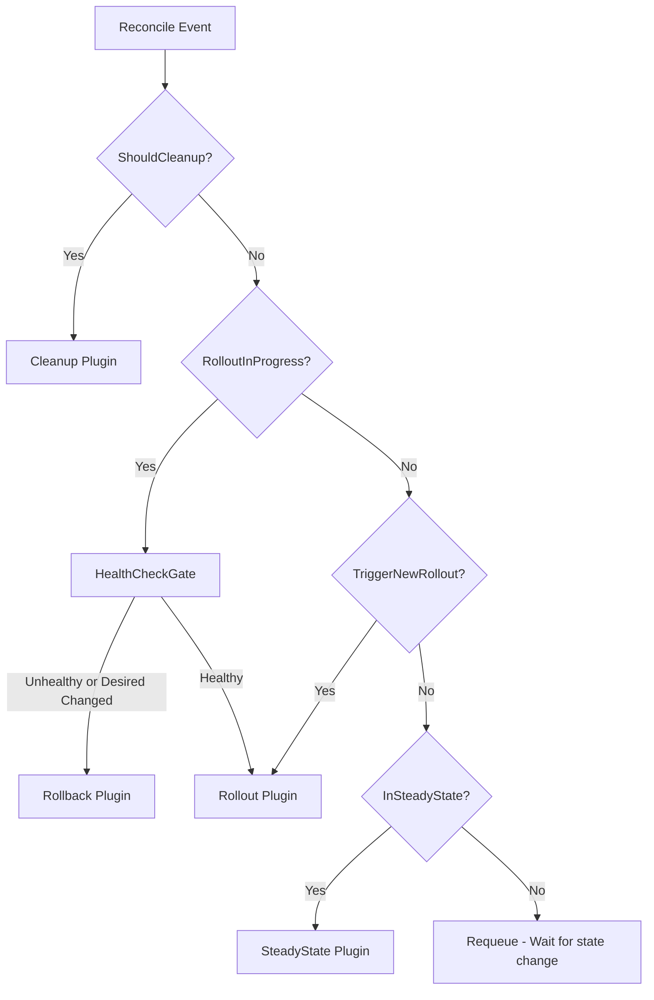
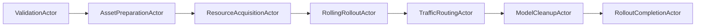
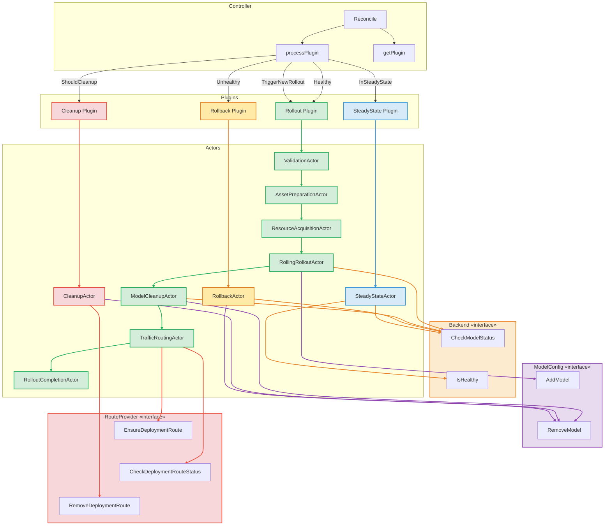

# Deployment Controller Architecture

This document describes the state machine and plugin/actor architecture for the Deployment Controller.

## Overview

The Deployment Controller follows a plugin-based architecture where:
1. The **Controller** receives reconciliation events and determines which plugin to invoke
2. **Plugins** (Rollout, Rollback, Cleanup, SteadyState) define the workflow for each lifecycle phase
3. **Actors** are the individual units of work within each plugin, executed sequentially by the **Condition Engine**


## Controller Decision Logic



## Rollout Plugin Actors



## Plugin and Actor Flow Diagram


## Deployment Stages

| Stage | Description | Triggered By |
|-------|-------------|--------------|
| `INVALID` | Initial state, deployment just created | New deployment |
| `VALIDATION` | Validating deployment spec and assets | `TriggerNewRollout()` |
| `RESOURCE_ACQUISITION` | Acquiring cluster resources | Validation passed |
| `PLACEMENT` | Deploying model to clusters | Resources acquired |
| `ROLLOUT_COMPLETE` | Model successfully deployed | All rollout actors satisfied |
| `ROLLOUT_FAILED` | Rollout failed (terminal) | Max attempts or critical error |
| `ROLLBACK_IN_PROGRESS` | Rolling back to previous state | Health check failed or desired changed |
| `ROLLBACK_COMPLETE` | Rollback successful | Rollback actor satisfied |
| `ROLLBACK_FAILED` | Rollback failed (terminal) | Max attempts |
| `CLEAN_UP_IN_PROGRESS` | Removing deployment resources | `ShouldCleanup()` |
| `CLEAN_UP_COMPLETE` | Cleanup successful, ready for deletion | Cleanup actor satisfied |
| `CLEAN_UP_FAILED` | Cleanup failed (terminal) | Max attempts |

## Actor Types and Responsibilities

### Rollout Actors (Sequential Execution)

1. **ValidationActor** (`Validated`)
   - Validates deployment specification
   - Checks inference server exists and is healthy

2. **AssetPreparationActor** (`AssetsPrepared`)
   - Prepares model assets for deployment
   - Verifies model availability in storage

3. **ResourceAcquisitionActor** (`ResourcesAcquired`)
   - Initializes target cluster connections
   - Prepares deployment target info

4. **RollingRolloutActor** (`RollingRolloutComplete`)
   - Adds model to ConfigMap via ModelConfig interface
   - Verifies model is ready via Backend interface (CheckModelStatus)
   - Tracks cluster-by-cluster deployment progress via metadata
   - States: PENDING → DEPLOYMENT_IN_PROGRESS → DEPLOYED

5. **TrafficRoutingActor** (`TrafficRoutingConfigured`)
   - Creates/updates HTTPRoute for deployment
   - Routes traffic to newly deployed model

6. **ModelCleanupActor** (`ModelCleanupComplete`)
   - Removes previous model from ConfigMap via ModelConfig interface
   - Verifies model is unloaded via Backend interface (CheckModelStatus)
   - Cleans up per cluster sequentially
   - States: PENDING → CLEANUP_IN_PROGRESS → CLEANED

7. **RolloutCompletionActor** (`RolloutCompleted`)
   - Finalizes the rollout process
   - Verifies all clusters are ready

### Other Plugin Actors

- **RollbackActor** (`RollbackComplete`) - Removes model via ModelConfig, verifies via Backend (CheckModelStatus)
- **CleanupActor** (`CleanupComplete`) - Removes model via ModelConfig, removes routes via RouteProvider
- **SteadyStateActor** (`StateSteady`) - Monitors model and server health via Backend (CheckModelStatus, IsHealthy)

## Condition Engine Execution

The Condition Engine executes actors sequentially:

```
For each actor in plugin.GetActors():
    1. Retrieve() - Check current condition status (idempotent)
    2. If condition NOT satisfied:
        a. Run() - Execute action to progress condition
        b. Stop iteration (only one action per reconcile)
    3. PutCondition() - Store updated condition in deployment status
```

The engine returns:
- `AreSatisfied=true, IsTerminal=true` - All conditions satisfied, move to next stage
- `AreSatisfied=false, IsTerminal=true` - Failed condition, enter terminal stage
- `AreSatisfied=false, IsTerminal=false` - Condition in progress, requeue

## Key Decision Functions

| Function | Returns True When |
|----------|-------------------|
| `TriggerNewRollout()` | Desired ≠ Candidate AND (Terminal OR Initialization) |
| `RolloutInProgress()` | Current ≠ Candidate AND NOT Terminal AND NOT Initialization |
| `ShouldRollback()` | Desired ≠ Candidate AND NOT Terminal AND NOT Initialization |
| `InSteadyState()` | Stage is ROLLOUT_COMPLETE OR ROLLBACK_COMPLETE |
| `ShouldCleanup()` | DeletionTimestamp set OR DeletionSpec.Deleted OR DesiredRevision nil |
| `IsTerminalStage()` | Stage is *_COMPLETE or *_FAILED |
