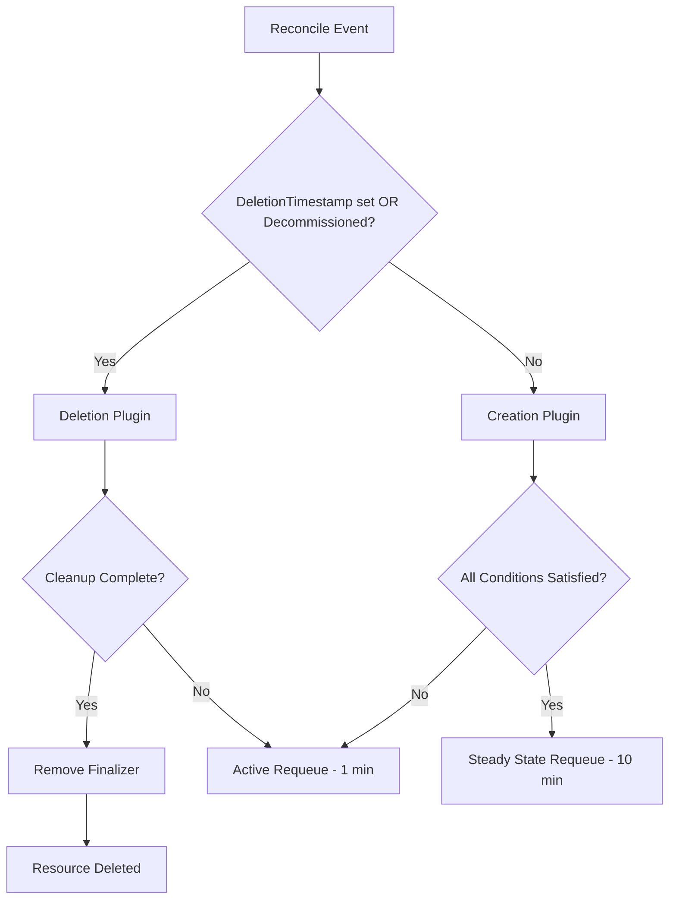
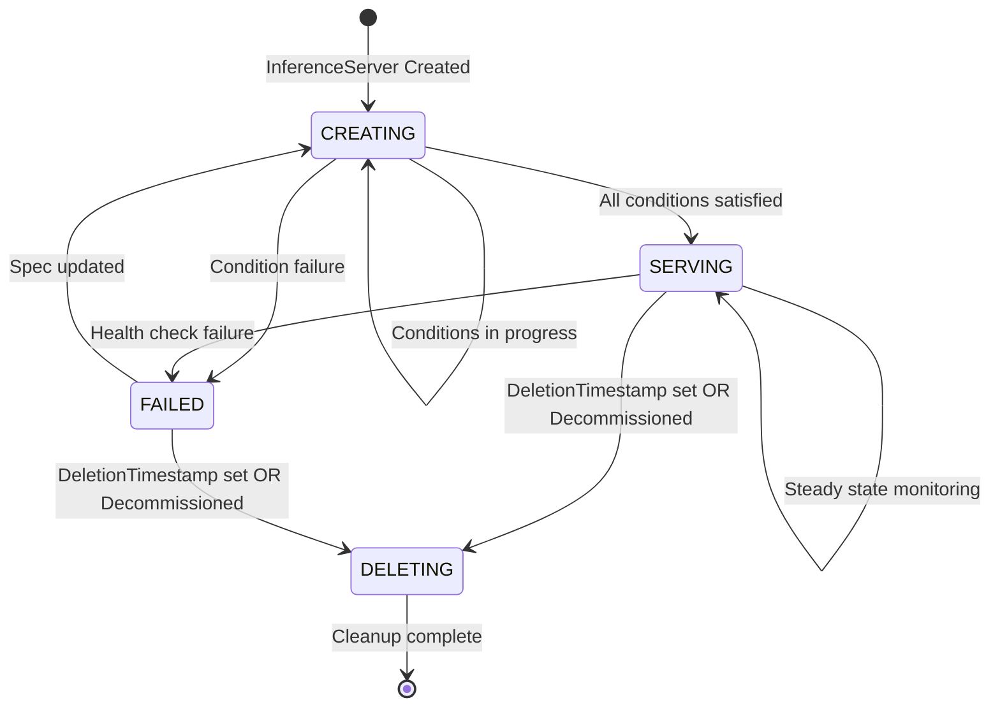
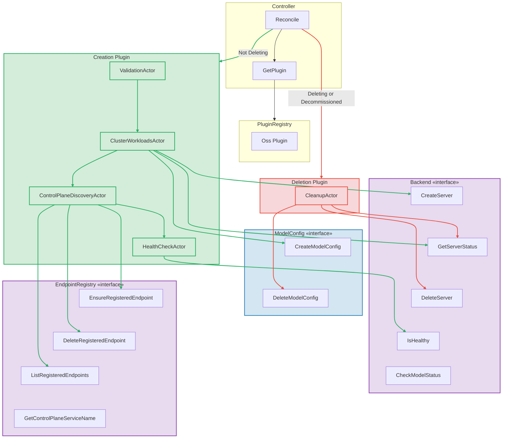
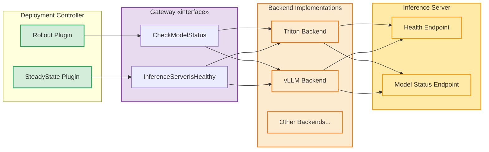

# Inference Server Controller Architecture

This document describes the state machine and plugin/actor architecture for the Inference Server Controller.

## Overview

The Inference Server Controller follows a plugin-based architecture where:
1. The **Controller** receives reconciliation events and determines which plugin to invoke (Creation or Deletion)
2. **Plugins** (Creation, Deletion) define the workflow for each lifecycle phase
3. **Actors** are the individual units of work within each plugin, executed sequentially by the **Condition Engine**

## Controller Decision Logic



## State Machine Diagram



## Plugin and Actor Flow Diagram



## Inference Server States

| State | Description | Triggered By |
|-------|-------------|--------------|
| `CREATING` | Initial state, provisioning infrastructure | New InferenceServer created |
| `SERVING` | Server is healthy and ready to serve requests | All creation conditions satisfied |
| `FAILED` | Server provisioning or health check failed | Condition failure |
| `DELETING` | Server resources being cleaned up | DeletionTimestamp set OR Decommissioned |

## Actor Types and Responsibilities

### Creation Plugin Actors (Sequential Execution)

1. **ValidationActor** (`TritonValidation`)
   - Validates backend type is TRITON
   - Validates deployment strategy configuration
   - Validates cluster targets for remote deployments

2. **ClusterWorkloadsActor** (`TritonClusterWorkloads`)
   - Creates Kubernetes Deployments and Services via Backend interface
   - Creates model ConfigMaps via ModelConfig interface
   - Provisions resources in all target clusters
   - Monitors cluster state until READY

3. **ControlPlaneDiscoveryActor** (`TritonControlPlaneDiscovery`)
   - Registers endpoints for remote clusters in control plane
   - Creates Istio ServiceEntry resources for cross-cluster routing
   - Prunes stale endpoints when clusters are removed

4. **HealthCheckActor** (`TritonHealthCheck`)
   - Polls backend health endpoints
   - Verifies server is healthy in all target clusters
   - Reports health status via conditions

### Deletion Plugin Actors

1. **CleanupActor** (`TritonCleanup`)
   - Deletes Kubernetes Deployments and Services via Backend interface
   - Deletes model ConfigMaps via ModelConfig interface
   - Removes resources from all target clusters
   - Verifies resources are fully deleted

## Interfaces

### Backend Interface

The Backend interface provides platform-specific logic for server and model management.

| Method | Description | Used By |
|--------|-------------|---------|
| `CreateServer()` | Provisions Kubernetes resources for inference server | ClusterWorkloadsActor |
| `GetServerStatus()` | Queries server state (CREATING, READY, FAILED, etc.) | ClusterWorkloadsActor, CleanupActor |
| `DeleteServer()` | Removes Kubernetes resources for inference server | CleanupActor |
| `IsHealthy()` | Checks backend health endpoints | HealthCheckActor |
| `CheckModelStatus()` | Checks if a model is loaded and ready | (Used by Deployment controller) |

### Gateway Interface

The Gateway interface provides a means for communicating directly with a deployed inference server from outside the InferenceServer controller. The Deployment Controller uses this interface to check model readiness and verify inference server health before and during model deployment.

Since each backend type (e.g., Triton, vLLM) has a unique way of verifying model status and server health, the Gateway implementation delegates to the appropriate Backend interface methods based on the `backendType` parameter.



| Method | Description | Used By |
|--------|-------------|---------|
| `CheckModelStatus()` | Verifies if a model is ready to serve requests | Rollout, Rollback, SteadyState Plugins |
| `InferenceServerIsHealthy()` | Checks if the inference server is healthy | SteadyState Plugin |

### ModelConfig Interface

The ModelConfig interface manages model configuration storage (e.g., Kubernetes ConfigMaps) for inference servers.

| Method | Description | Used By |
|--------|-------------|---------|
| `CreateModelConfig()` | Creates model configuration storage for an inference server | ClusterWorkloadsActor |
| `DeleteModelConfig()` | Deletes model configuration storage for an inference server | CleanupActor |

### EndpointRegistry Interface

The EndpointRegistry manages inference server endpoints across multiple clusters for service mesh routing.

| Method | Description | Used By |
|--------|-------------|---------|
| `EnsureRegisteredEndpoint()` | Registers cluster endpoint in control plane | ControlPlaneDiscoveryActor |
| `DeleteRegisteredEndpoint()` | Removes cluster endpoint registration | ControlPlaneDiscoveryActor |
| `ListRegisteredEndpoints()` | Lists all registered cluster endpoints | ControlPlaneDiscoveryActor |
| `GetControlPlaneServiceName()` | Returns control plane service name | (Used by Deployment controller) |

## Condition Engine Execution

The Condition Engine executes actors sequentially:

```
For each actor in plugin.GetActors():
    1. Retrieve() - Check current condition status (idempotent)
    2. If condition NOT satisfied:
        a. Run() - Execute action to progress condition
        b. Stop iteration (only one action per reconcile)
    3. PutCondition() - Store updated condition in server status
```

The engine returns:
- `AreSatisfied=true` - All conditions satisfied, requeue after 10 minutes (steady state)
- `AreSatisfied=false` - Conditions in progress, requeue after 1 minute (active)

## Deployment Strategies

The Inference Server supports two deployment strategies:

### Control Plane Cluster Deployment
- Server is deployed to the same cluster as the control plane
- No cross-cluster discovery needed
- Simplest deployment model

### Remote Cluster Deployment
- Server is deployed to one or more remote Kubernetes clusters
- Requires cluster targets with connection credentials
- Control plane discovery creates ServiceEntry for routing
- Supports multi-cluster inference serving

## Key Functions

| Function | Description |
|----------|-------------|
| `isDecommissioned()` | Returns true if `Spec.DecomSpec.Decommission` is set |
| `ParseState()` | Derives server state from conditions and deletion status |
| `UpdateDetails()` | Updates status with backend-specific information |
| `UpdateConditions()` | Filters conditions relevant to current plugin |
