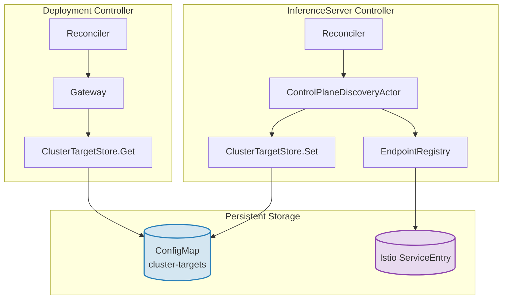
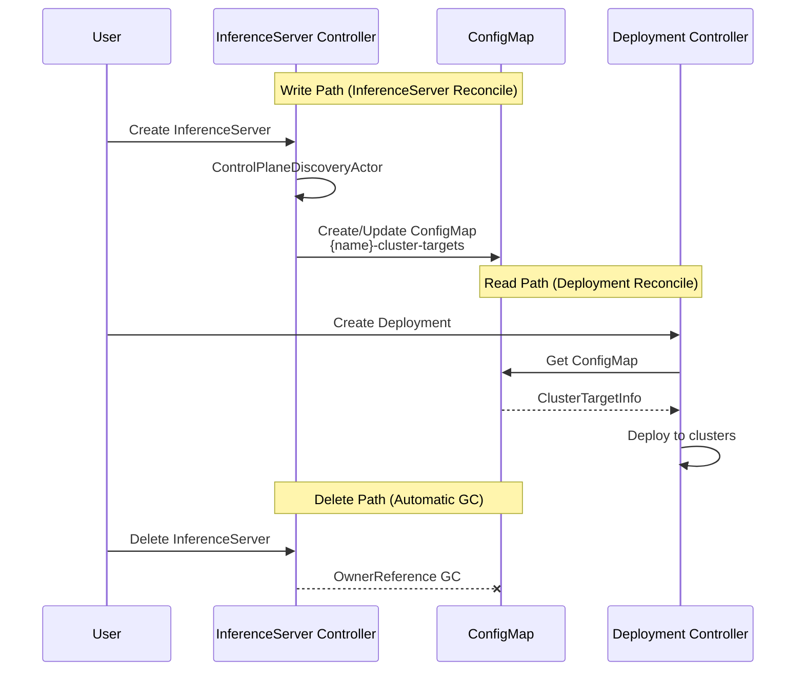

# Proposal: Decoupling Deployment Controller from InferenceServer CR Queries

## Problem Statement

The deployment controller requires cluster target information to deploy models across multiple clusters. Currently, it calls `gateway.GetDeploymentTargetInfo()` on every reconciliation, which:

1. **Directly fetches the InferenceServer CR** from the API server
2. **Lists registered endpoints** from the EndpointRegistry (Istio ServiceEntry)
3. **Combines both** to return the `DeploymentTargetInfo`

```go
// Current implementation in gateway.go
func (g *gateway) GetDeploymentTargetInfo(ctx context.Context, logger *zap.Logger, inferenceServerName string, namespace string) (*DeploymentTargetInfo, error) {
    inferenceServer, err := g.getInferenceServer(ctx, logger, inferenceServerName, namespace)  // API call
    // ...
    endpoints, err := g.endpointRegistry.ListRegisteredEndpoints(ctx, logger, inferenceServerName, namespace)
    // ...
}
```

### Issues

1. **Tight coupling**: The deployment controller has a direct dependency on the InferenceServer CR structure
2. **Redundant API calls**: Every deployment reconciliation triggers a fresh GET for the InferenceServer CR
3. **Cross-resource dependency**: Deployment controller reaches into InferenceServer's domain

### Constraints

- **Must be persistent**: Solution must survive controller restarts
- **No InferenceServer CR queries**: Deployment controller should never directly query the InferenceServer CR

## Proposed Solution: ConfigMap-Based ClusterTargetStore

The InferenceServer controller writes resolved cluster targets to a **ConfigMap**. The deployment controller reads from this ConfigMap, never touching the InferenceServer CR.



### Why ConfigMap?

| Requirement | ConfigMap |
|-------------|-----------|
| Persistent across restarts | ✓ Stored in etcd |
| No InferenceServer CR queries | ✓ Separate resource |
| No proto/CRD changes | ✓ Native Kubernetes |
| Observable | ✓ `kubectl get cm` |
| Owned by InferenceServer | ✓ OwnerReference for cleanup |

### Interface

```go
// clustertargetstore/interface.go
package clustertargetstore

import "context"

// ClusterTargetInfo contains resolved cluster target information for an inference server.
type ClusterTargetInfo struct {
    BackendType    string          `json:"backend_type"`
    ClusterTargets []ClusterTarget `json:"cluster_targets"`
}

// ClusterTarget represents a single cluster's connection details.
type ClusterTarget struct {
    ClusterID             string `json:"cluster_id"`
    Host                  string `json:"host"`
    Port                  string `json:"port"`
    TokenTag              string `json:"token_tag"`
    CaDataTag             string `json:"ca_data_tag"`
    IsControlPlaneCluster bool   `json:"is_control_plane_cluster"`
}

// Store provides read/write access to cluster target information.
// Writers: InferenceServer controller (ControlPlaneDiscoveryActor)
// Readers: Deployment controller (Gateway)
type Store interface {
    // Set stores the cluster target info for an inference server.
    // Creates or updates a ConfigMap with the resolved cluster targets.
    Set(ctx context.Context, namespace, inferenceServerName string, info *ClusterTargetInfo, owner metav1.Object) error

    // Get retrieves the cluster target info for an inference server.
    // Reads from the ConfigMap. Returns nil if not found.
    Get(ctx context.Context, namespace, inferenceServerName string) (*ClusterTargetInfo, error)

    // Delete removes cluster target info when an inference server is deleted.
    // Handled automatically via OwnerReference garbage collection.
    Delete(ctx context.Context, namespace, inferenceServerName string) error
}
```

### ConfigMap Implementation

```go
// clustertargetstore/configmap_store.go
package clustertargetstore

import (
    "context"
    "encoding/json"
    "fmt"

    corev1 "k8s.io/api/core/v1"
    "k8s.io/apimachinery/pkg/api/errors"
    metav1 "k8s.io/apimachinery/pkg/apis/meta/v1"
    "sigs.k8s.io/controller-runtime/pkg/client"
    "sigs.k8s.io/controller-runtime/pkg/controller/controllerutil"
)

const (
    configMapSuffix = "-cluster-targets"
    dataKey         = "targets.json"
    labelManagedBy  = "app.kubernetes.io/managed-by"
    labelComponent  = "app.kubernetes.io/component"
    labelInfServer  = "michelangelo.ai/inference-server"
)

type configMapStore struct {
    client client.Client
}

func NewConfigMapStore(c client.Client) Store {
    return &configMapStore{client: c}
}

func (s *configMapStore) Set(ctx context.Context, namespace, inferenceServerName string, info *ClusterTargetInfo, owner metav1.Object) error {
    data, err := json.Marshal(info)
    if err != nil {
        return fmt.Errorf("failed to marshal cluster target info: %w", err)
    }

    cmName := inferenceServerName + configMapSuffix
    cm := &corev1.ConfigMap{
        ObjectMeta: metav1.ObjectMeta{
            Name:      cmName,
            Namespace: namespace,
            Labels: map[string]string{
                labelManagedBy: "michelangelo",
                labelComponent: "cluster-target-store",
                labelInfServer: inferenceServerName,
            },
        },
        Data: map[string]string{
            dataKey: string(data),
        },
    }

    // Set owner reference for automatic garbage collection
    if owner != nil {
        if err := controllerutil.SetControllerReference(owner, cm, s.client.Scheme()); err != nil {
            return fmt.Errorf("failed to set owner reference: %w", err)
        }
    }

    existing := &corev1.ConfigMap{}
    err = s.client.Get(ctx, client.ObjectKey{Namespace: namespace, Name: cmName}, existing)
    if errors.IsNotFound(err) {
        return s.client.Create(ctx, cm)
    }
    if err != nil {
        return fmt.Errorf("failed to get existing ConfigMap: %w", err)
    }

    existing.Data = cm.Data
    existing.Labels = cm.Labels
    return s.client.Update(ctx, existing)
}

func (s *configMapStore) Get(ctx context.Context, namespace, inferenceServerName string) (*ClusterTargetInfo, error) {
    cmName := inferenceServerName + configMapSuffix
    cm := &corev1.ConfigMap{}
    if err := s.client.Get(ctx, client.ObjectKey{Namespace: namespace, Name: cmName}, cm); err != nil {
        if errors.IsNotFound(err) {
            return nil, nil
        }
        return nil, fmt.Errorf("failed to get ConfigMap: %w", err)
    }

    data, ok := cm.Data[dataKey]
    if !ok {
        return nil, nil
    }

    var info ClusterTargetInfo
    if err := json.Unmarshal([]byte(data), &info); err != nil {
        return nil, fmt.Errorf("failed to unmarshal cluster target info: %w", err)
    }

    return &info, nil
}

func (s *configMapStore) Delete(ctx context.Context, namespace, inferenceServerName string) error {
    // Deletion is automatic via OwnerReference garbage collection.
    // This method exists for explicit cleanup if needed.
    cmName := inferenceServerName + configMapSuffix
    cm := &corev1.ConfigMap{
        ObjectMeta: metav1.ObjectMeta{
            Name:      cmName,
            Namespace: namespace,
        },
    }
    if err := s.client.Delete(ctx, cm); err != nil && !errors.IsNotFound(err) {
        return fmt.Errorf("failed to delete ConfigMap: %w", err)
    }
    return nil
}
```

### Integration Points

#### 1. InferenceServer Controller: Write on Endpoint Discovery

Modify `ControlPlaneDiscoveryActor` to write to the store after successful endpoint registration:

```go
// plugins/oss/triton/creation/control_plane_discovery.go
func (a *ControlPlaneDiscoveryActor) Run(ctx context.Context, condition *apipb.Condition, resource *v2pb.InferenceServer) (*apipb.Condition, error) {
    // ... existing endpoint registration logic ...
    
    // Build cluster target info from registered endpoints
    info := &clustertargetstore.ClusterTargetInfo{
        BackendType:    resource.Spec.BackendType.String(),
        ClusterTargets: buildClusterTargets(resource),
    }
    
    // Persist to ConfigMap (owned by InferenceServer for GC)
    if err := a.clusterTargetStore.Set(ctx, resource.Namespace, resource.Name, info, resource); err != nil {
        return conditionsUtils.GenerateFalseCondition(condition, "ClusterTargetStoreFailed",
            fmt.Sprintf("Failed to persist cluster targets: %v", err)), nil
    }
    
    return conditionsUtils.GenerateTrueCondition(condition), nil
}

func buildClusterTargets(resource *v2pb.InferenceServer) []clustertargetstore.ClusterTarget {
    if resource.Spec.GetDeploymentStrategy().GetControlPlaneClusterDeployment() != nil {
        return []clustertargetstore.ClusterTarget{{
            IsControlPlaneCluster: true,
        }}
    }
    
    var targets []clustertargetstore.ClusterTarget
    for _, ct := range resource.Spec.GetDeploymentStrategy().GetRemoteClusterDeployment().GetClusterTargets() {
        targets = append(targets, clustertargetstore.ClusterTarget{
            ClusterID: ct.ClusterId,
            Host:      ct.GetKubernetes().GetHost(),
            Port:      ct.GetKubernetes().GetPort(),
            TokenTag:  ct.GetKubernetes().GetTokenTag(),
            CaDataTag: ct.GetKubernetes().GetCaDataTag(),
        })
    }
    return targets
}
```

#### 2. Gateway: Read from Store Only

Remove the InferenceServer CR query entirely:

```go
// gateways/gateway.go
func (g *gateway) GetDeploymentTargetInfo(ctx context.Context, logger *zap.Logger, inferenceServerName string, namespace string) (*DeploymentTargetInfo, error) {
    info, err := g.clusterTargetStore.Get(ctx, namespace, inferenceServerName)
    if err != nil {
        return nil, fmt.Errorf("failed to get cluster targets from store: %w", err)
    }
    if info == nil {
        return nil, fmt.Errorf("cluster targets not found for inference server %s/%s (not yet reconciled?)", namespace, inferenceServerName)
    }

    return &DeploymentTargetInfo{
        BackendType:    parseBackendType(info.BackendType),
        ClusterTargets: convertToTargetConnections(info.ClusterTargets),
    }, nil
}
```

#### 3. Cleanup: Automatic via OwnerReference

The ConfigMap has an OwnerReference to the InferenceServer, so Kubernetes garbage collection deletes it automatically when the InferenceServer is deleted. No explicit cleanup needed.

## Data Flow Diagram



## Benefits

| Aspect | Before | After |
|--------|--------|-------|
| InferenceServer CR queries | Every deployment reconcile | **Never** |
| Persistence | N/A | ✓ ConfigMap in etcd |
| Restart safety | N/A | ✓ Survives restarts |
| Coupling | Deployment → InferenceServer CR | Deployment → ConfigMap |
| Cleanup | Manual | Automatic (OwnerReference) |
| Observable | Hidden in code | `kubectl get cm -l michelangelo.ai/inference-server` |

## File Structure

```
go/components/inferenceserver/
├── clustertargetstore/
│   ├── BUILD.bazel
│   ├── interface.go              # Store interface
│   ├── configmap_store.go        # ConfigMap implementation
│   ├── configmap_store_test.go
│   └── module.go                 # fx module
├── gateways/
│   ├── gateway.go                # Updated: reads from store only
│   └── ...
└── plugins/oss/triton/
    └── creation/
        └── control_plane_discovery.go  # Updated: writes to store
```

## Alternative Considered: Dedicated CRD

A dedicated `ClusterTargetBinding` CRD was considered but rejected:

| Aspect | ConfigMap | Dedicated CRD |
|--------|-----------|---------------|
| Proto changes | None | Required |
| Code generation | None | Required |
| API registration | Built-in | Required |
| Complexity | Low | High |
| Semantics | Data storage | Resource with lifecycle |

ConfigMap is sufficient since cluster targets are derived data, not a user-facing resource.
