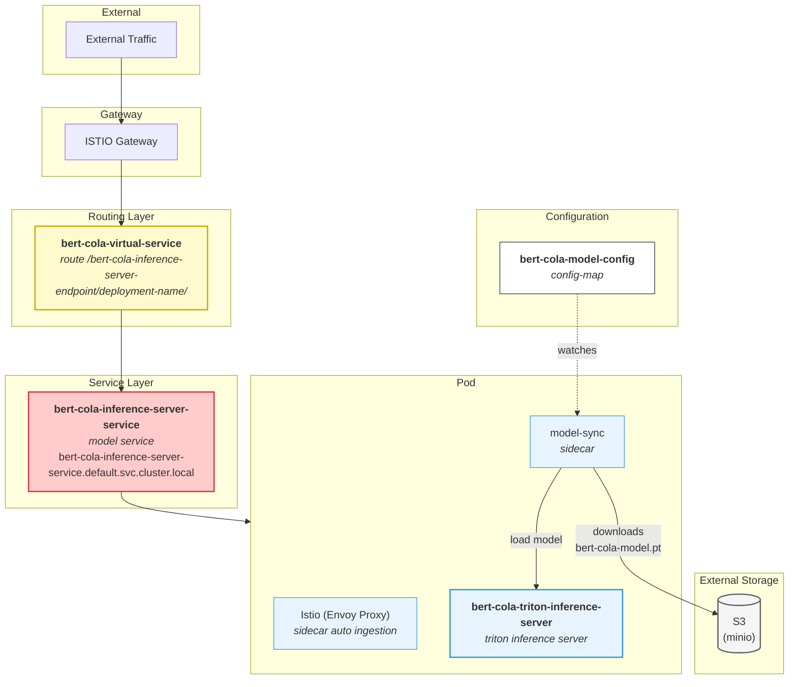

# Traffic Flow Architecture

This diagram shows the traffic flow for model inference requests and model loading.

```mermaid
flowchart TD
    subgraph External
        ET[External Traffic]
    end

    subgraph Gateway
        IG[ISTIO Gateway]
    end

    subgraph Routing["Routing Layer"]
        VS["<b>bert-cola-virtual-service</b><br/><i>route /bert-cola-inference-server-endpoint/deployment-name/</i>"]
    end

    subgraph Service["Service Layer"]
        SVC["<b>bert-cola-inference-server-service</b><br/><i>model service</i><br/>bert-cola-inference-server-service.default.svc.cluster.local"]
    end

    subgraph Pod["Pod"]
        direction LR
        ENVOY["Istio (Envoy Proxy)<br/><i>sidecar auto ingestion</i>"]
        MS["model-sync<br/><i>sidecar</i>"]
        TRITON["<b>bert-cola-triton-inference-server</b><br/><i>triton inference server</i>"]
    end

    subgraph Config["Configuration"]
        CM["<b>bert-cola-model-config</b><br/><i>config-map</i>"]
    end

    subgraph Storage["External Storage"]
        S3[("S3<br/>(minio)")]
    end

    ET --> IG
    IG --> VS
    VS --> SVC
    SVC --> Pod

    CM -.->|watches| MS
    MS -->|"downloads<br/>bert-cola-model.pt"| S3
    MS -->|load model| TRITON

    style VS fill:#fffacd,stroke:#d4a800,stroke-width:2px
    style SVC fill:#ffcccb,stroke:#dc3545,stroke-width:2px
    style ENVOY fill:#e8f4fd,stroke:#3498db,stroke-width:1px
    style MS fill:#e8f4fd,stroke:#3498db,stroke-width:1px
    style TRITON fill:#e8f4fd,stroke:#3498db,stroke-width:2px
    style CM fill:#fff,stroke:#333,stroke-width:1px
    style S3 fill:#f5f5f5,stroke:#666,stroke-width:2px
```
