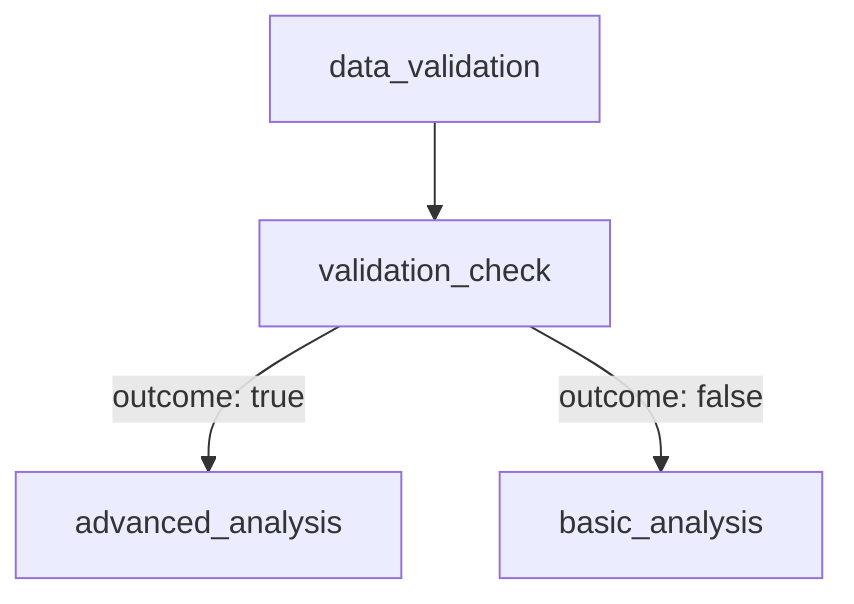

# Notebook Workflow with Conditional Logic

This directory contains a complete example of a conditional notebook workflow using advanced YAML DAG features including `if_else_task` and outcome-based dependencies.

## Overview

The workflow demonstrates sophisticated conditional execution patterns where:
1. **Data validation** determines workflow path
2. **Conditional logic** evaluates validation results
3. **Outcome-based routing** runs different analysis based on validation status

## Files

| File | Description |
|------|-------------|
| `notebook_workflow.yaml` | Main workflow definition with if_else_task logic |
| `pipeline.yaml` | Kubernetes pipeline resource (base64-encoded YAML) |
| `pipeline_run.yaml` | Pipeline run execution configuration |
| `data_validation.ipynb` | Notebook that validates data and returns status |
| `advanced_analysis.ipynb` | Complex analysis for validated data |
| `basic_analysis.ipynb` | Fallback analysis for invalid data |

## Workflow Structure



## YAML Features Used

### 1. If-Else Task (`if_else_task`)

```yaml
- task_name: "validation_check"
  if_else_task:
      inputs: "{{tasks.data_validation.output}}"
      condition:
          op: "EQUAL_TO"
          left: "{{tasks.data_validation.output.status}}"
          right: "PASSED"
```

**Features:**
- **Conditional evaluation** of task outputs
- **Template expressions** for dynamic data access
- **Outcome generation** (`true`/`false`) for downstream routing

### 2. Outcome-Based Dependencies

```yaml
- task_name: "advanced_analysis"
  depends_on:
      - task_name: "validation_check"
        outcome: "true"  # Only runs if validation passes
```

**Features:**
- **Conditional execution** based on upstream task outcomes
- **Automatic skipping** when conditions aren't met
- **Parallel conditional branches** (advanced vs basic analysis)

### 3. Template Expressions

```yaml
# Reference task outputs
inputs: "{{tasks.data_validation.output}}"

# Access nested fields
left: "{{tasks.data_validation.output.status}}"

# Pass task data between stages
parameters: "{{tasks.data_validation.task_values}}"

# Use pipeline parameters
data_size: "{{parameters.data_size}}"
```

**Features:**
- **Dynamic data flow** between tasks
- **Nested field access** for complex data structures
- **Pipeline parameter injection**

## Generated Starlark Code

The YAML converts to executable Starlark:

```python
def conditional_notebook_workflow():
    # Step 1: Data validation
    data_validation_result = __ray_task__(
        "examples.notebook_workflow.executor.notebook_executor",
        head_cpu=2, head_memory="4Gi", ...
    )(notebook_path, data_size, seed)

    # Step 2: Conditional logic
    if data_validation_result.get("status") == "PASSED":
        validation_check_result = {"outcome": "true", "inputs": data_validation_result}
    else:
        validation_check_result = {"outcome": "false", "inputs": data_validation_result}

    # Step 3: Conditional execution
    if validation_check_result.get("outcome") == "true":
        advanced_analysis_result = __ray_task__(...)(notebook_path, parameters)
    else:
        advanced_analysis_result = None

    if validation_check_result.get("outcome") == "false":
        basic_analysis_result = __ray_task__(...)(notebook_path, parameters)
    else:
        basic_analysis_result = None
```

## Execution Flow

### 1. Data Validation Phase
```yaml
- task_name: "data_validation"
  notebook_task:
      user_parameters:
          notebook_path: "examples/notebook_workflow/data_validation.ipynb"
          data_size: "{{parameters.data_size}}"
          seed: "{{parameters.seed}}"
```

- Executes data validation notebook
- Returns `{"status": "PASSED"|"FAILED", "data": {...}}`
- Provides shared data via `task_values`

### 2. Conditional Evaluation Phase
```yaml
- task_name: "validation_check"
  if_else_task:
      condition:
          op: "EQUAL_TO"
          left: "{{tasks.data_validation.output.status}}"
          right: "PASSED"
```

- Evaluates validation status
- Returns `{"outcome": "true"|"false", "inputs": {...}}`
- Creates routing decision for downstream tasks

### 3. Conditional Execution Phase

**Advanced Analysis** (validation passed):
```yaml
- task_name: "advanced_analysis"
  depends_on:
      - task_name: "validation_check"
        outcome: "true"
```

**Basic Analysis** (validation failed):
```yaml
- task_name: "basic_analysis"
  depends_on:
      - task_name: "validation_check"
        outcome: "false"
```

## Running the Workflow

### Option 1: Direct Pipeline Creation
```bash
kubectl apply -f pipeline.yaml
```

### Option 2: Pipeline Run
```bash
kubectl apply -f pipeline_run.yaml
```

### Option 3: CLI Execution
```bash
# Using mactl (if available)
mactl pipeline run notebook-workflow-test \
    --namespace ma-dev-test \
    --param data_size=100 \
    --param seed=42
```

## Parameters

| Parameter | Default | Description |
|-----------|---------|-------------|
| `data_size` | `100` | Size of dataset for validation |
| `seed` | `42` | Random seed for reproducible results |

## Advanced Features

### Automatic Dependency Detection
The converter automatically detects implicit dependencies from template references:
- `{{tasks.data_validation.output}}` → creates dependency on `data_validation`
- No need for explicit `depends_on` in `validation_check`

### Resource Configuration
Each task specifies compute resources:
```yaml
task_parameters:
    head_cpu: 4
    head_memory: "8Gi"
    worker_cpu: 2
    worker_memory: "4Gi"
    worker_instances: 2
```

### Error Handling
- Failed validation → `basic_analysis` runs
- Invalid data → workflow continues with fallback logic
- Task failures → proper error propagation

## Best Practices

1. **Use meaningful task names** for clarity in logs
2. **Document conditional logic** in YAML comments
3. **Test both success and failure paths**
4. **Set appropriate resource limits** for each task type
5. **Use template expressions** for dynamic data flow
6. **Validate YAML structure** before deployment

## Troubleshooting

### Common Issues

1. **Template reference errors**: Ensure task names match exactly
2. **Missing dependencies**: Check if `validation_check` runs after `data_validation`
3. **Condition evaluation**: Verify the expected status values
4. **Resource limits**: Ensure sufficient cluster resources

### Debug Commands

```bash
# Check pipeline status
kubectl get pipeline notebook-workflow-test -n ma-dev-test

# View pipeline run logs
kubectl logs -f pipeline-run-name -n ma-dev-test

# Inspect generated workflow
kubectl get pipeline notebook-workflow-test -o yaml
```

## Implementation Details

This workflow uses the Michelangelo Uniflow framework with:
- **Ray task infrastructure** for notebook execution
- **Starlark workflow generation** from YAML
- **Template expression evaluation** for dynamic data flow
- **Conditional task routing** based on outcomes

The `if_else_task` feature enables sophisticated workflow patterns beyond simple linear execution, making it suitable for data validation, A/B testing, and multi-path processing scenarios.